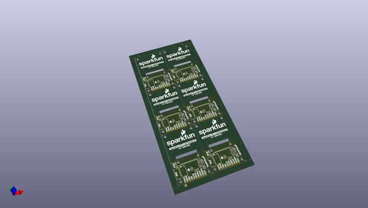
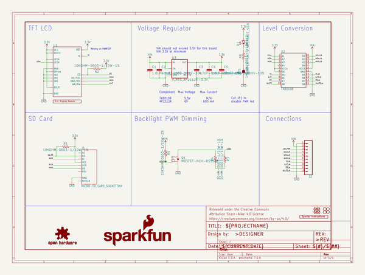
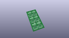
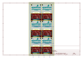
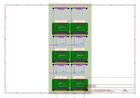
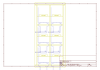
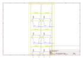
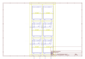
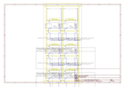

# OOMP Project  
## LCD_TFT_Breakout_1in8_128x160  by sparkfun  
  
oomp key: oomp_projects_flat_sparkfun_lcd_tft_breakout_1in8_128x160  
(snippet of original readme)  
  
SparkFun LCD TFT Breakout 1.8" 128x160  
========================================  
  
  
  
[*LCD TFT Breakout 1.8" 128x160 (LCD-15143)*](https://www.sparkfun.com/products/15143)  
  
A 128x160 color (18 bit!) TFT LCD display breakout with 4-wire SPI interface and microSD card holder. You can use this breakout to easily add visual display/interface capabilities to a project as well as all the storage you might need for multimedia files.   
  
Repository Contents  
-------------------  
  
* **/Documentation** - Data sheets, additional product information  
* **/Hardware** - Eagle design files (.brd, .sch)  
* **/Production** - Production panel files (.brd)  
  
Documentation  
--------------  
* **[Library (Top Level)](https://github.com/sparkfun/SparkFun_HyperDisplay)** - Arduino library for general control of 2D visual interfaces.  
* **[Library (Mid Level)](https://github.com/sparkfun/HyperDisplay_ILI9163C_ArduinoLibrary)** - Arduino library for all ILI9163 drivers (depends on top level).  
* **[Library (Bottom Level)](https://github.com/sparkfun/HyperDisplay_KWH018ST01_4WSPI_ArduinoLibrary)** - Arduino library for the display module used in this breakout (depends on mid level).  
* **[Hookup Guide](https://learn.sparkfun.com/tutorials/tft-lcd-breakout-18in-128x160-hookup-guide)** - Basic hookup guide for the LCD TFT Breakout 1.8" 128x160.  
* **[SparkFun Fritzing repo](https:  
  full source readme at [readme_src.md](readme_src.md)  
  
source repo at: [https://github.com/sparkfun/LCD_TFT_Breakout_1in8_128x160](https://github.com/sparkfun/LCD_TFT_Breakout_1in8_128x160)  
## Board  
  
  
## Schematic  
  
  
  
[schematic pdf](working_schematic.pdf)  
## Images  
  
  
  
  
  
  
  
  
  
  
  
  
  
  
  
  
