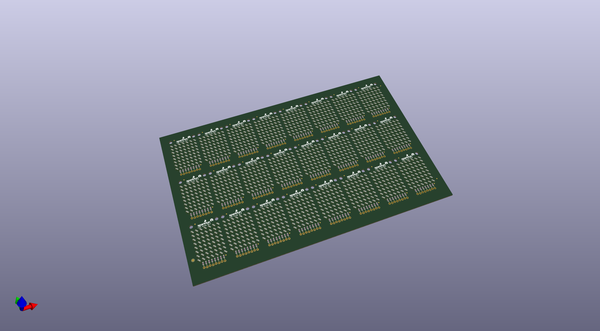
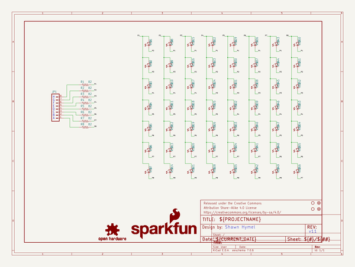
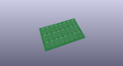
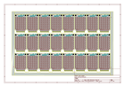
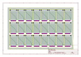
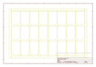
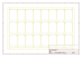
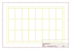
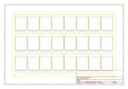

# OOMP Project  
## LED_Array_8x7  by sparkfun  
  
(snippet of original readme)  
  
SparkFun LED Array 8x7  
======================  
  
  
  
[*SparkFun LED Array - 8x7*](https://www.sparkfun.com/products/13795)  
  
56 Charlieplexed LEDs arranged in an 8x7 array. The board requires 8 pins, and the library supports any ATmega 328-based Arduino.  
  
Repository Contents  
-------------------  
  
* **/Hardware** - Eagle design files (.brd, .sch)  
* **/Libraries** - Libraries for use with the SparkFun LED Array - 8x7  
* **/Production** - Production panel files (.brd)  
  
Documentation  
--------------  
* **[Library](https://github.com/sparkfun/SparkFun_LED_Array_8x7_Arduino_Library)** - Arduino library for the LED Array 8x7.  
* **[Hookup Guide](https://learn.sparkfun.com/tutorials/sparkfun-led-array-8x7-hookup-guide)** - Basic hookup guide for the LED Array 8x7.  
  
Product Versions  
----------------  
* [COM-13795](https://www.sparkfun.com/products/13795)- Basic part and short description here  
  
Version History  
---------------  
* [v_H1.1_L1.3.1](https://github.com/sparkfun/LED_Array_8x7/tree/v_H1.1_L1.3.1) - Hardware version 1.1, library version 1.3.1. Compatible with Arduino 1.6+  
* [v_H1.1_L1.3.0](https://github.com/sparkfun/LED_Array_8x7/tree/v_H1.1_L1.3.0) - Hardware version 1.1, library version 1.3.0. Compatible with Arduino 1.6+  
  
License Information  
-------------------  
  
This product is _**open source**_!   
  
Please review the LICENSE.md file for license information.   
  
If you have any questions or c  
  full source readme at [readme_src.md](readme_src.md)  
  
source repo at: [https://github.com/sparkfun/LED_Array_8x7](https://github.com/sparkfun/LED_Array_8x7)  
## Board  
  
  
## Schematic  
  
  
  
[schematic pdf](working_schematic.pdf)  
## Images  
  
  
  
  
  
  
  
  
  
  
  
  
  
  
  
  
