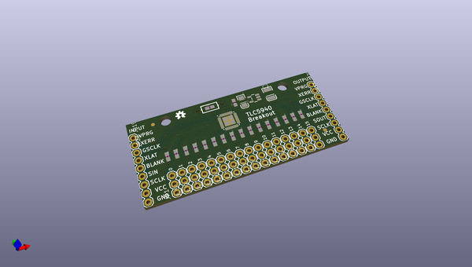
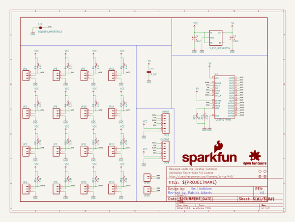

# OOMP Project  
## LED_Driver_Breakout-TLC5940  by sparkfun  
  
(snippet of original readme)  
  
SparkFun LED Driver Breakout -TLC5940  
========================================  
  
  
  
[*SparkFun LED Driver Breakout -TLC5940(BOB-10616)*](https://www.sparkfun.com/products/10616)  
  
 The TLC5940 is a 16 channel PWM unit with 12 bit duty cycle control (0-4095), 6 bit current limit control (0-63), and a daisy chainable serial interface.   
 This breakout board is a good way to take full advantage of this useful IC.   
 All 16 PWM channels are broken out to standard 0.1" headers, which run alongside convenient voltage and ground rails.  
  
Repository Contents  
-------------------  
  
* **/Firmware** - Example code.   
* **/Hardware** - Eagle design files (.brd, .sch)  
* **/Libraries** - Libraries for use with the TLC5940.  
* **/Production** - Production panel files (.brd)  
  
Documentation  
--------------  
* **[Library](https://github.com/sparkfun/SparkFun_TLC5940_Arduino_Library)** - Arduino Library for the TLC5940.  
* **[SparkFun Fritzing repo](https://github.com/sparkfun/Fritzing_Parts)** - Fritzing diagrams for SparkFun products.  
* **[SparkFun 3D Model repo](https://github.com/sparkfun/3D_Models)** - 3D models of SparkFun products.   
  
Version History  
---------------  
  
* [v1.3](https://github.com/sparkfun/LED_Driver_Breakout-TLC5940/tree/V_H1.3_L1.0.1) - Hardware version 1.3. Currently live.   
* [v1.2](https://github.com/sparkfun/LED_Driver_Breakout-TLC5940/tree/V_H.1_L1.0.1) - Hardware version 1.2  
  
  
Lic  
  full source readme at [readme_src.md](readme_src.md)  
  
source repo at: [https://github.com/sparkfun/LED_Driver_Breakout-TLC5940](https://github.com/sparkfun/LED_Driver_Breakout-TLC5940)  
## Board  
  
  
## Schematic  
  
  
  
[schematic pdf](working_schematic.pdf)  
## Images  
