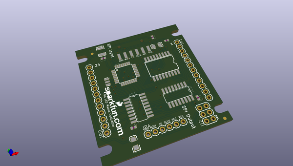
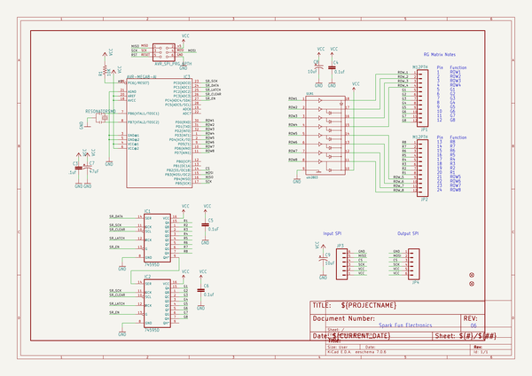
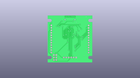
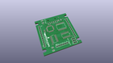
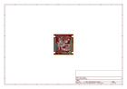
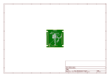
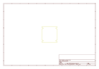
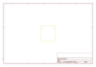
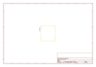
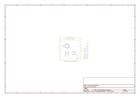

# OOMP Project  
## LED_Matrix_Serial_Interface_RedGreen  by sparkfun  
  
(snippet of original readme)  
  
LED Matrix Serial Interface-Red/Green  
======================================  
  
  
[    
*LED Matrix- Serial Interface- Red/Green (COM-00759)*](https://www.sparkfun.com/products/759)  
  
This is a medium sized LED Matrix with a backpack that has been designed to take SPI serial input and display any graphics you pass it.  
  
Repository Contents  
-------------------  
* **/Firmware** - Firmware that comes installed on the backpack  
* **/Hardware** - All Eagle design files (.brd, .sch)  
  
License Information  
-------------------  
The hardware is released under [Creative Commons Share-alike 3.0](http://creativecommons.org/licenses/by-sa/3.0/).    
All other code is open source so please feel free to do anything you want with it; you buy me a beer if you use this and we meet someday ([Beerware license](http://en.wikipedia.org/wiki/Beerware)).  
  
  
  full source readme at [readme_src.md](readme_src.md)  
  
source repo at: [https://github.com/sparkfun/LED_Matrix_Serial_Interface_RedGreen](https://github.com/sparkfun/LED_Matrix_Serial_Interface_RedGreen)  
## Board  
  
  
## Schematic  
  
  
  
[schematic pdf](working_schematic.pdf)  
## Images  
  
  
  
  
  
  
  
  
  
  
  
  
  
  
  
  
