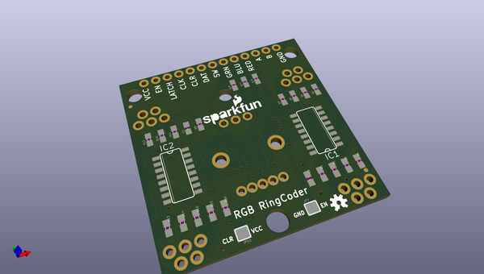
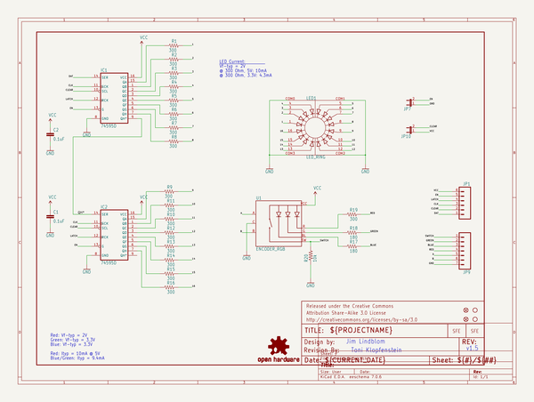
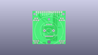
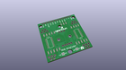
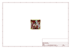
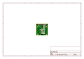
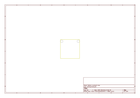
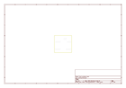
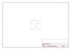
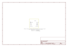

# OOMP Project  
## LED_RingCoder_Breakout  by sparkfun  
  
oomp key: oomp_projects_flat_sparkfun_led_ringcoder_breakout  
(snippet of original readme)  
  
**NOTE:** *This product has been retired from our catalog. If you are looking for more up-to-date info, please check out some of these resources to see how other users are still hacking and improving on this product.*  
* *[SparkFun Forum](https://forum.sparkfun.com/)*  
* *[Comments Here on GitHub](https://github.com/sparkfun/LED_RingCoder_Breakout/issues)*  
* *[IRC Channel](https://www.sparkfun.com/news/263)*  
  
LED RingCoder Breakout - RGB  
============================  
  
  
[    
*LED RingCoder Breakout-RGB (BOB-11040)*](https://www.sparkfun.com/products/11040)  
  
This breakout board gives you a pretty slick interface for rotary input. This board uses two 8-bit shift registers to control a circular  
LED bargraph which can be used to indicate the virtual position of a rotary encoder.   
  
Repository Contents  
-------------------  
* **/Firmware** - Example Arduino sketch to use with this board   
* **/Hardware** - All Eagle design files (.brd, .sch)  
* **/Production** - Test bed files and production panel files  
  
Product Versions  
----------------  
  
Compatible with the following rotary encoder and LED bar graphs:   
  
* [COM-10982](https://www.sparkfun.com/products/10982)- RGB rotary encoder-illuminated.  
* [COM-10591](https://www.sparkfun.com/products/retired/10591)- Circular LED Bargraphs - Green  
* [COM-10592](https://www.sparkfun.com/products/retired/10592)- Circular LED Bargraphs - Blue  
* [COM-1  
  full source readme at [readme_src.md](readme_src.md)  
  
source repo at: [https://github.com/sparkfun/LED_RingCoder_Breakout](https://github.com/sparkfun/LED_RingCoder_Breakout)  
## Board  
  
  
## Schematic  
  
  
  
[schematic pdf](working_schematic.pdf)  
## Images  
  
  
  
  
  
  
  
  
  
  
  
  
  
  
  
  
