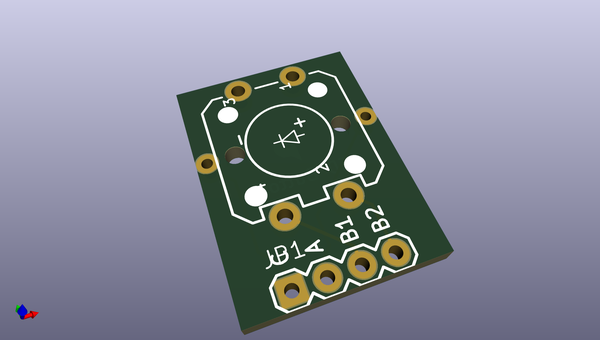
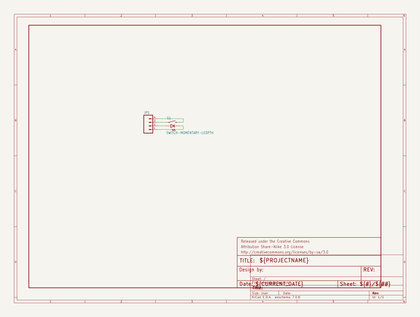
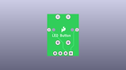
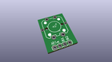
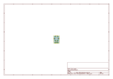
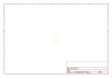
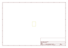
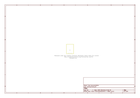

# OOMP Project  
## LED_Tactile_Button_Breakout  by sparkfun  
  
oomp key: oomp_projects_flat_sparkfun_led_tactile_button_breakout  
(snippet of original readme)  
  
LED Tactile Button Breakout  
===========================  
[   
*LED Tactile Button Breakout (BOB-10467)*](https://www.sparkfun.com/products/10467)  
  
This is a breakout board for tactile LED buttons.   
  
  
Repository Contents  
-------------------  
* **/Hardware** - All Eagle design files (.brd, .sch)  
  
  
License Information  
-------------------  
The hardware is released under [Creative Commons Share-alike 3.0](http://creativecommons.org/licenses/by-sa/3.0/).    
  
  full source readme at [readme_src.md](readme_src.md)  
  
source repo at: [https://github.com/sparkfun/LED_Tactile_Button_Breakout](https://github.com/sparkfun/LED_Tactile_Button_Breakout)  
## Board  
  
  
## Schematic  
  
  
  
[schematic pdf](working_schematic.pdf)  
## Images  
  
  
  
  
  
  
  
  
  
  
  
  
  
  
  
  
