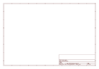
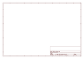

# OOMP Project  
## LilyPad_Arduino_328_Main_Board  by sparkfun  
  
oomp key: oomp_projects_flat_sparkfun_lilypad_arduino_328_main_board  
(snippet of original readme)  
  
SparkFun LilyPad Arduino 328 Main Board  
=======================================  
  
  
[*SparkFun LilyPad Arduino 328 Main Board  
 (DEV-09266)*](https://www.sparkfun.com/products/9266)  
  
This is LilyPad Arduino - the main board consisting of an ATmega328 with the Arduino bootloader and a minimum number of external components to keep it as small (and as simple) as possible. Board will run from 2V to 5V.   
  
Repository Contents  
-------------------  
  
* **/Hardware** - All Eagle design files (.brd, .sch)  
License Information  
-------------------  
The hardware is released under [Creative Commons ShareAlike 4.0 International](https://creativecommons.org/licenses/by-sa/4.0/).  
  
Distributed as-is; no warranty is given.  
  
_A portion of this sale is given back to Dr. Leah Buechley for continued development and education of e-textiles and also to Arduino LLC to help fund continued development of new tools and new IDE features._  
  
  full source readme at [readme_src.md](readme_src.md)  
  
source repo at: [https://github.com/sparkfun/LilyPad_Arduino_328_Main_Board](https://github.com/sparkfun/LilyPad_Arduino_328_Main_Board)  
## Board  
  
  
## Schematic  
  
  
  
[schematic pdf](working_schematic.pdf)  
## Images  
  
  
  
  
  
  
  
  
  
  
  
  
  
  
