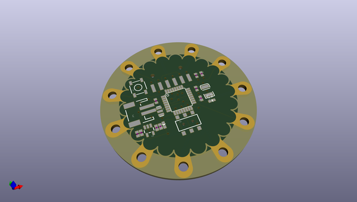
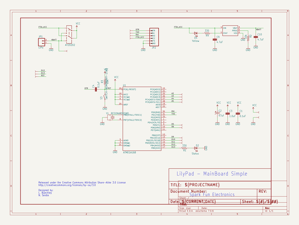

# OOMP Project  
## LilyPad_Arduino_Simple  by sparkfun  
  
(snippet of original readme)  
  
LilyPad Arduino Simple  
======================  
  
  
  
[*LilyPad Arduino Simple Board (DEV-10274)*](https://www.sparkfun.com/products/10274)  
  
This LilyPad board is smaller than the LilyPad Main Board, with fewer pins. However, it does have a   
built-in power supply socket, and an on/off switch.   
  
Repository Contents  
-------------------  
  
* **/Hardware** - All Eagle design files (.brd, .sch, .STL)  
* **/Production** - Test bed files and production panel files  
  
License Information  
-------------------  
The hardware is released under [Creative Commons ShareAlike 4.0 International](https://creativecommons.org/licenses/by-sa/4.0/).  
The code is beerware; if you see me (or any other SparkFun employee) at the local, and you've found our code helpful, please buy us a round!  
  
Distributed as-is; no warranty is given.  
  
  full source readme at [readme_src.md](readme_src.md)  
  
source repo at: [https://github.com/sparkfun/LilyPad_Arduino_Simple](https://github.com/sparkfun/LilyPad_Arduino_Simple)  
## Board  
  
  
## Schematic  
  
  
  
[schematic pdf](working_schematic.pdf)  
## Images  
