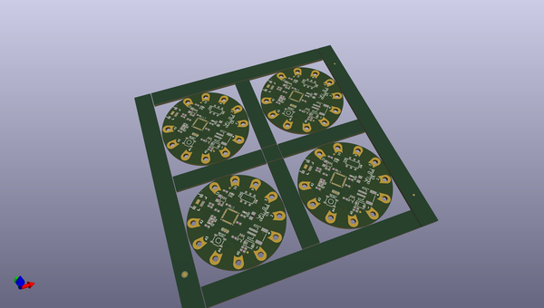
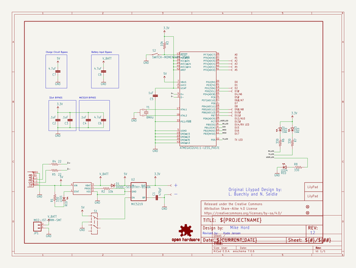

# OOMP Project  
## LilyPad_Arduino_USB  by sparkfun  
  
oomp key: oomp_projects_flat_sparkfun_lilypad_arduino_usb  
(snippet of original readme)  
  
LilyPad Arduino USB  
===================  
  
[    
*LilyPad Arduino USB (DEV-11990)*](https://www.sparkfun.com/products/11190)  
  
The LilyPad Arduino USB is a sewable Arduino compatible board with a built-in LiPo battery charger. It connects via microUSB cable to your computer, which means that, unlike regular LilyPad boards, it needs no external hardware to be programmed.   
  
As of Arduino release 1.0.2, the LilyPad Arduino USB is supported as a native board- no additional files needed!  
  
Firmware was compiled in WinAVR-20100110.    
Hardware was developed in EAGLE 6.3.0.  
  
License Information  
-------------------  
The hardware design is released under [CC-SA v3 license](http://creativecommons.org/licenses/by-sa/3.0/us/).  
  
The firmware is released under a modified beerware license, allowing for the purchase of any libation, alcoholic or non.  
  
  
  full source readme at [readme_src.md](readme_src.md)  
  
source repo at: [https://github.com/sparkfun/LilyPad_Arduino_USB](https://github.com/sparkfun/LilyPad_Arduino_USB)  
## Board  
  
  
## Schematic  
  
  
  
[schematic pdf](working_schematic.pdf)  
## Images  
