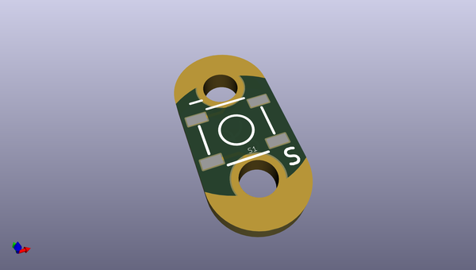
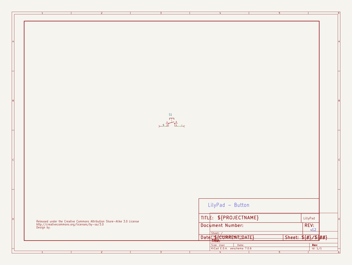
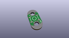
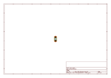
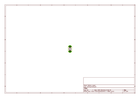
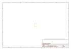
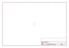
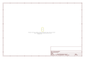

# OOMP Project  
## LilyPad_Button_Board  by sparkfun  
  
oomp key: oomp_projects_flat_sparkfun_lilypad_button_board  
(snippet of original readme)  
  
SparkFun LilyPad Button Board  
========================================  
  
  
  
[*SparkFun LilyPad Button Board (DEV-08776)*](https://www.sparkfun.com/products/8776)  
  
We designed this board to give the user a low profile button without any sharp edges.   
Button closes when you push it and opens when you release (momentary push button).  
  
Repository Contents  
-------------------  
* **/Hardware** - All Eagle design files (.brd, .sch)  
  
Documentation  
-------------------  
* **[Hookup Guide](https://learn.sparkfun.com/tutorials/lilypad-buttons-and-switches)**  
  
License Information  
-------------------  
  
This product is _**open source**_!   
  
Please review the LICENSE.md file for license information.   
  
If you have any questions or concerns on licensing, please contact techsupport@sparkfun.com.  
  
Distributed as-is; no warranty is given.  
  
- Your friends at SparkFun.  
  
_<COLLABORATION CREDIT>_  
  
_Note: A portion of this sale is given back to Dr. Leah Buechley for continued development and education of e-textiles._  
  
  full source readme at [readme_src.md](readme_src.md)  
  
source repo at: [https://github.com/sparkfun/LilyPad_Button_Board](https://github.com/sparkfun/LilyPad_Button_Board)  
## Board  
  
  
## Schematic  
  
  
  
[schematic pdf](working_schematic.pdf)  
## Images  
  
  
  
  
  
  
  
  
  
  
  
  
  
  
  
  
