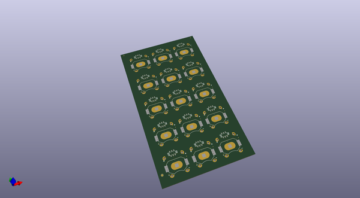
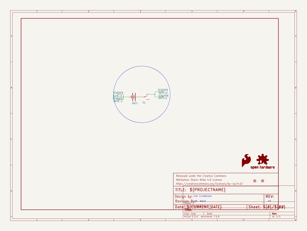

# OOMP Project  
## LilyPad_Coin_Cell_Battery_Holder-Switched  by sparkfun  
  
oomp key: oomp_projects_flat_sparkfun_lilypad_coin_cell_battery_holder_switched  
(snippet of original readme)  
  
SparkFun LilyPad Coin Cell Battery Holder-Switched  
========================================  
  
  
  
[*SparkFun LilyPad Coin Cell Battery Holder-Switched (DEV-11285)*](https://www.sparkfun.com/products/11285)  
  
This LilyPad Coin Cell Battery Holder has a small slide switch installed on the board,   
in-line with the power so you can shut off your project and save batteries.  
  
Repository Contents  
-------------------  
* **/Hardware** - All Eagle design files (.brd, .sch)  
  
  
License Information  
-------------------  
The hardware is released under [Creative Commons ShareAlike 4.0 International](https://creativecommons.org/licenses/by-sa/4.0/).  
Note: A portion of this sale is given back to Dr. Leah Buechley for continued development and education of e-textiles.  
  
Distributed as-is; no warranty is given.  
  
  full source readme at [readme_src.md](readme_src.md)  
  
source repo at: [https://github.com/sparkfun/LilyPad_Coin_Cell_Battery_Holder-Switched](https://github.com/sparkfun/LilyPad_Coin_Cell_Battery_Holder-Switched)  
## Board  
  
  
## Schematic  
  
  
  
[schematic pdf](working_schematic.pdf)  
## Images  
