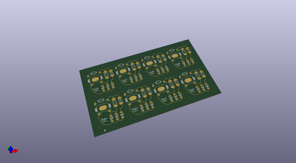
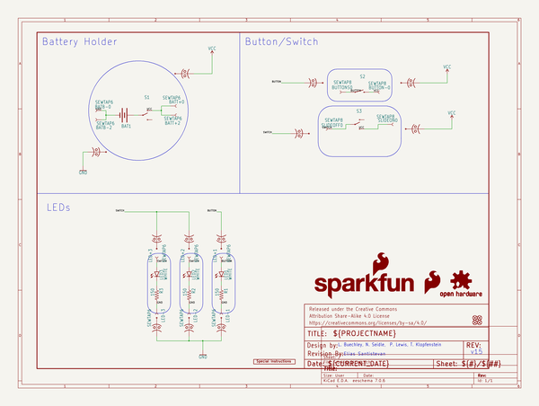

# OOMP Project  
## LilyPad_E-Sewing_Kit  by sparkfun  
  
oomp key: oomp_projects_flat_sparkfun_lilypad_e_sewing_kit  
(snippet of original readme)  
  
Lilypad E-Sewing ProtoSnap  
====================  
  
<table class="table table-hover table-striped table-bordered">  
  <tr>  
   <td><a href="https://www.sparkfun.com/products/14546">

</a>
</td>  
   <td><a href="https://www.sparkfun.com/products/14528">

</a></td>  
  </tr>  
  <tr>  
    <td>
LilyPad E-Sewing ProtoSnap [<a href="https://www.sparkfun.com/products/14546">DEV-14546</a>]
</td>  
    <td>
LilyPad E-Sewing ProtoSnap Kit [<a href="https://www.sparkfun.com/products/14528">KIT-14528</a>]
</td>  
  </tr>  
</table>  
  
The LilyPad E-Sewing ProtoSnap is a great way to explore how buttons and switches behave in simple e-sewing circuits before crafting your project. It comes pre-wired so you can plug in a battery and use the switch and button to turn the LEDs on and off.   
  
Repository Contents  
-------------------  
* **/Hardware** - All Eagle design files (.brd, .sch)  
* **/Production** - Production panel files (.brd)  
  
Documentation  
--------------  
* **[Hookup Guide](https://learn.sparkfun.com/tutorials/lilypad-e-sewing-protosnap-hookup-guide)** - Basic hookup guide for the E-Sewing ProtoSnap.  
  
Version History  
---------------  
* [Hw-v15](https://github.com/sparkfun/LilyPad_E-Sewin  
  full source readme at [readme_src.md](readme_src.md)  
  
source repo at: [https://github.com/sparkfun/LilyPad_E-Sewing_Kit](https://github.com/sparkfun/LilyPad_E-Sewing_Kit)  
## Board  
  
  
## Schematic  
  
  
  
[schematic pdf](working_schematic.pdf)  
## Images  
