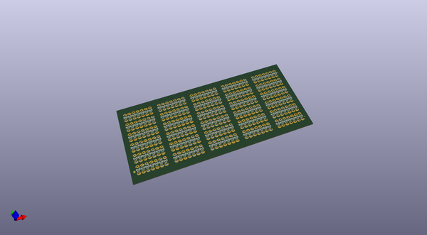
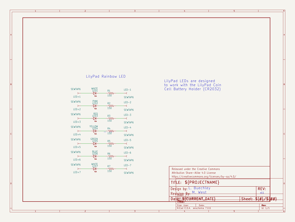
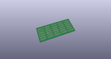
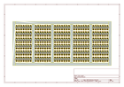
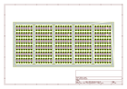
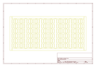
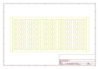

# OOMP Project  
## LilyPad_LED_Rainbow  by sparkfun  
  
(snippet of original readme)  
  
LilyPad LED Rainbow Board  
========================  
  
    
[*LilyPad LED Rainbow Board(DEV-13903)*](https://www.sparkfun.com/products/13903)  
  
The LilyPad LED Rainbow Board is panel containing 5 strips of 7 LilyPad LED boards, one in each of 7 colors--red, green, blue, pink, purple, yellow, and white.  
  
Features:  
  
* 7 LED colors  
* text on board to indicate color  
  
  
Repository Contents  
-------------------  
* **/Hardware** - PCB Design files   
* **/Production** - Panel files and any pogo bed design files  
  
Documentation  
-------------  
* **[SparkFun Fritzing repo](https://github.com/sparkfun/Fritzing_Parts)** - Fritzing diagrams for SparkFun products.  
* **[SparkFun 3D Model repo](https://github.com/sparkfun/3D_Models)** - 3D models of SparkFun products.  
* **[Hookup Guide](https://learn.sparkfun.com/tutorials/ldk-experiment-1-lighting-up-a-basic-circuit)** - Basic hookup guide for the LilyPad Rainbow LEDs.  
  
  
License Information  
-------------------  
  
This product is _**open source**_!  
  
Please review the LICENSE.md file for license information.  
  
If you have any questions or concerns on licensing, please contact techsupport@sparkfun.com.  
  
Distributed as-is; no warranty is given.  
  
- Your friends at SparkFun.  
  
  
  full source readme at [readme_src.md](readme_src.md)  
  
source repo at: [https://github.com/sparkfun/LilyPad_LED_Rainbow](https://github.com/sparkfun/LilyPad_LED_Rainbow)  
## Board  
  
  
## Schematic  
  
  
  
[schematic pdf](working_schematic.pdf)  
## Images  
  
  
  
  
  
  
  
  
  
  
  
  
  
  
  
  
