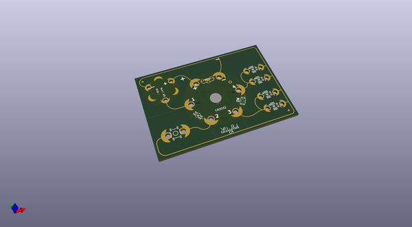
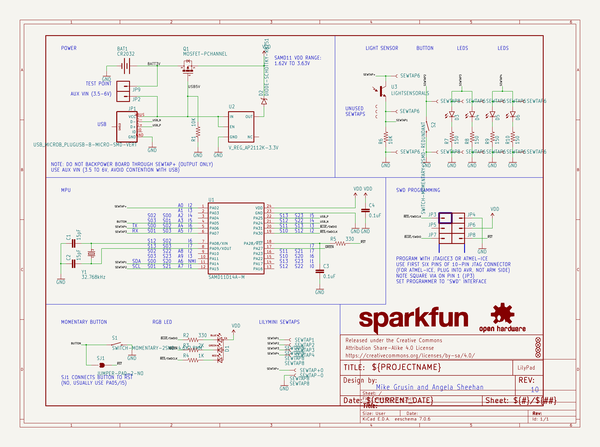

# OOMP Project  
## LilyPad_LilyMini_ProtoSnap  by sparkfun  
  
oomp key: oomp_projects_flat_sparkfun_lilypad_lilymini_protosnap  
(snippet of original readme)  
  
LilyMini ProtoSnap  
========================================  
  
  
  
[*LilyMini ProtoSnap (https://www.sparkfun.com/products/14063)*](https://www.sparkfun.com/products/14063)  
  
The LilyMini ProtoSnap is a great way to create interactive e-textile circuits. At the center of the board is a pre-programmed LilyMini microcontroller connected to a LilyPad Light Sensor, LilyPad Button and two pairs of LilyPad LEDs.  
  
Like other ProtoSnap boards, the LilyMini ProtoSnap has all of these parts connected together on the board, enabling you to play with the circuit before you sew. When you're ready to make your project, snap out the parts and sew them together!  
  
The LilyMini ProtoSnap ships with pre-loaded code that exercises all the LilyPad pieces connected to it. The sample code has three modes, which can be selected by pressing the LilyPad Button on the bottom-left side of the ProtoSnap. The built-in RGB LED on the LilyMini will change color to indicate which mode has been selected:  
  
* White: All LEDs on.  
* Magenta: LEDs fade in and out in a breathing pattern. When the light sensor is covered, LEDs fade faster.  
* Cyan/Blue: When the board is in darkness, the LEDs will twinkle (perfect for night-lights)  
  
You can use the built-in code to make your own projects (see the hook-up guide below), or you can reprogram the LilyMini using the Arduino system . **Reprogr  
  full source readme at [readme_src.md](readme_src.md)  
  
source repo at: [https://github.com/sparkfun/LilyPad_LilyMini_ProtoSnap](https://github.com/sparkfun/LilyPad_LilyMini_ProtoSnap)  
## Board  
  
  
## Schematic  
  
  
  
[schematic pdf](working_schematic.pdf)  
## Images  
  
  
  
  
  
  
  
  
  
  
  
  
  
  
  
  
