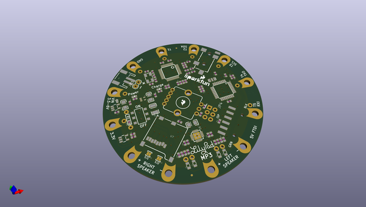

# OOMP Project  
## LilyPad_MP3_Player  by sparkfun  
  
oomp key: oomp_projects_flat_sparkfun_lilypad_mp3_player  
(snippet of original readme)  
  
SparkFun LilyPad MP3  
========================================  
  
  
  
[*SparkFun LilyPad MP3 (DEV-11013)*](https://www.sparkfun.com/products/11013)  
  
The LilyPad MP3 Player is an amazing little board that contains everything you need to play almost any audio file you wish. You can use it to create MP3-playing hoodies, talking teddy bears, or anything else your imagination can come up with!  
  
--- Installation:  
  
You should install the latest version of the Arduino IDE, available at http://www.arduino.cc.  
  
This software requires several nonstandard libraries:  
	SdFat (by William Greiman)  
	SFEMP3Shield (by Bill Porter)  
	pinChangeInt (by Lex Talionis)  
	  
	The current version of these libraries as of this date are included in this archive.  
  
**TL;DR:** The one-step procedure is to drag the contents of the Arduino folder to your personal Arduino sketch folder. This will create a "libraries" folder (containing support libraries), and a "LilyPad MP3 Player" folder (containing example sketches).  
  
To install the libraries manually, copy the "libraries" folder to your personal Arduino sketch directory. (If there is already a "libraries" folder there, go ahead and add the included libraries to it.) You'll need to restart the Arduino IDE to get it to recognize the new libraries.  
  
To install the example sketches, copy the "LilyPad MP3 Player" folder to your personal Arduino   
  full source readme at [readme_src.md](readme_src.md)  
  
source repo at: [https://github.com/sparkfun/LilyPad_MP3_Player](https://github.com/sparkfun/LilyPad_MP3_Player)  
## Board  
  
  
## Schematic  
  
  
  
[schematic pdf](working_schematic.pdf)  
## Images  
