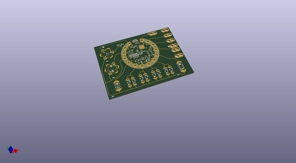

# OOMP Project  
## LilyPad_ProtoSnap_Plus  by sparkfun  
  
(snippet of original readme)  
  
SparkFun LilyPad ProtoSnap Plus  
========================================  
  
<table class="table table-hover table-striped table-bordered">  
  <tr>  
   <td><a href="https://www.sparkfun.com/products/14346">

</a>
</td>  
   <td><a href="https://www.sparkfun.com/products/12922">

</a></td>  
  </tr>  
  <tr>  
    <td>
LilyPad ProtoSnap Plus [<a href="https://www.sparkfun.com/products/14346">DEV-14346</a> ]
</td>  
    <td>
LilyPad ProtoSnap Plus Kit [<a href="https://www.sparkfun.com/products/12922">DEV-12922</a>]
</td>  
  </tr>  
</table>  
  
Snappable prototyping board with 32u4, light sensor, buzzer, button, and leds.   
  
To use the ProtoSnap Plus with Arduino, install the [SparkFun Arduino_Boards](https://github.com/sparkfun/Arduino_Boards) package for avr version 1.1.7 or later.  
  
Base examples for this board are included in the package.  Select "LilyPad USB Plus" as a board type, then see examples for that board.  
  
For extra information on Linux use, see [/Documentation/LinuxInstallation.md](https://github.com/sparkfun/LilyPad_ProtoSnap_Plus/tree/master/Documentation/LinuxInstallation.md).  
  
Repository Contents  
-------------------  
  
* **/Documentation** - pin mapping and design informatio  
  full source readme at [readme_src.md](readme_src.md)  
  
source repo at: [https://github.com/sparkfun/LilyPad_ProtoSnap_Plus](https://github.com/sparkfun/LilyPad_ProtoSnap_Plus)  
## Board  
  
  
## Schematic  
  
  
  
[schematic pdf](working_schematic.pdf)  
## Images  
