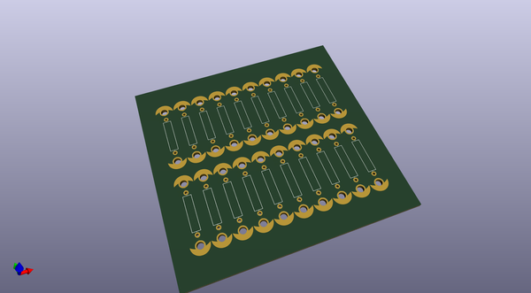
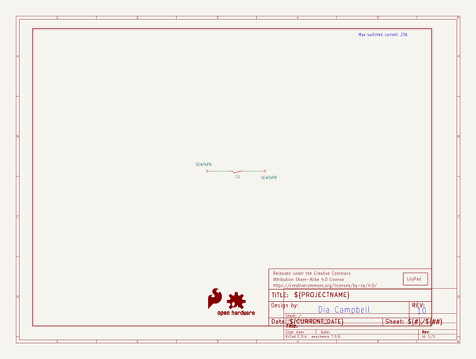
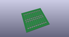
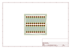
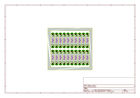
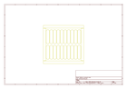
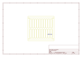
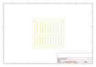

# OOMP Project  
## LilyPad_Reed_Switch  by sparkfun  
  
(snippet of original readme)  
  
SparkFun LilyPad Reed Switch  
========================================  
  
  
  
[*LilyPad Reed Switch (DEV-13343)*](https://www.sparkfun.com/products/13343)  
  
A magnetically-activated switch designed for easy use in e-textiles projects.  
  
Repository Contents  
-------------------  
  
* **/Hardware** - Eagle design files (.brd, .sch)  
* **/Production** - Production panel files (.brd)  
  
Documentation  
--------------  
  
* **[Hookup Guide](https://learn.sparkfun.com/tutorials/lilypad-reed-switch-hookup-guide?_ga=1.257312139.1628578815.1436805952)** - Basic hookup guide for the LilyPad Reed Switch.  
* **[SparkFun Fritzing repo](https://github.com/sparkfun/Fritzing_Parts)** - Fritzing diagrams for SparkFun products.  
* **[SparkFun 3D Model repo](https://github.com/sparkfun/3D_Models)** - 3D models of SparkFun products.   
  
  
License Information  
-------------------  
  
This product is _**open source**_!   
  
Please review the LICENSE.md file for license information.   
  
If you have any questions or concerns on licensing, please contact techsupport@sparkfun.com.  
  
Distributed as-is; no warranty is given.  
  
<3 <3 <3 Your friends at SparkFun.  
  
_Created in collaboration with Dr. Leah Buechley_  
  
  full source readme at [readme_src.md](readme_src.md)  
  
source repo at: [https://github.com/sparkfun/LilyPad_Reed_Switch](https://github.com/sparkfun/LilyPad_Reed_Switch)  
## Board  
  
  
## Schematic  
  
  
  
[schematic pdf](working_schematic.pdf)  
## Images  
  
  
  
  
  
  
  
  
  
  
  
  
  
  
  
  
