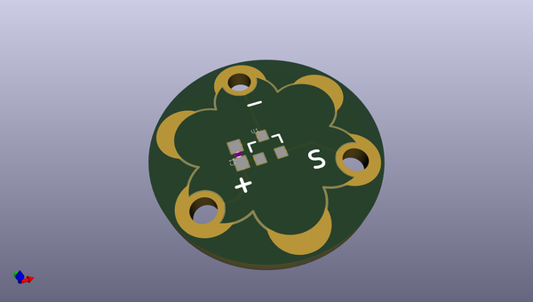
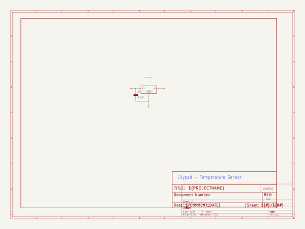

# OOMP Project  
## LilyPad_Temperature_Sensor  by sparkfun  
  
(snippet of original readme)  
  
LilyPad Temperature Sensor  
========================================  
  
  
  
[*LilyPad Temperature Sensor (DEV-08777)*](https://www.sparkfun.com/products/8777)  
  
Detecting temperature changes has never been easier.   
The MCP9700 is a small thermistor type temperature sensor.   
This sensor will output 0.5V at 0 degrees C, 0.75V at 25 C, and 10mV per degree C. Doing an analog to digital conversion on the signal line will allow you to establish the local ambient temperature.   
Detect physical touch based on body heat and ambient conditions with this small sensor.  
  
Repository Contents  
-------------------  
* **/Firmware** - Arduino Example code   
* **/Hardware** - Eagle design files (.brd, .sch)  
* **/Production** - Production panel files (.brd)  
  
Documentation  
--------------  
* **[Hookup Guide](https://learn.sparkfun.com/tutorials/lilypad-temperature-sensor-hookup-guide)** - Basic Hookup Guide for the LilyPad temperature sensor.  
* **[SparkFun Fritzing repo](https://github.com/sparkfun/Fritzing_Parts)** - Fritzing diagrams for SparkFun products.  
* **[SparkFun 3D Model repo](https://github.com/sparkfun/3D_Models)** - 3D models of SparkFun products.   
  
License Information  
-------------------  
This product is _**open source**_!   
  
The **hardware** is released under [Creative Commons ShareAlike 4.0 International](https://creativecommons.org/licenses/by-sa/4.0/).  
  
Please use, reuse, and modify these files as you se  
  full source readme at [readme_src.md](readme_src.md)  
  
source repo at: [https://github.com/sparkfun/LilyPad_Temperature_Sensor](https://github.com/sparkfun/LilyPad_Temperature_Sensor)  
## Board  
  
  
## Schematic  
  
  
  
[schematic pdf](working_schematic.pdf)  
## Images  
