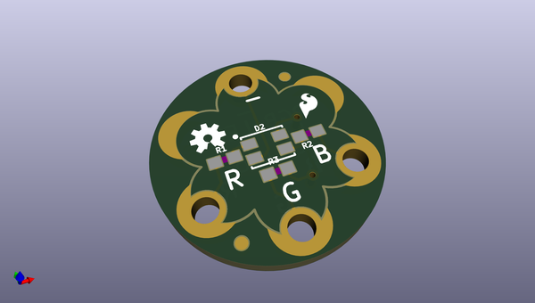
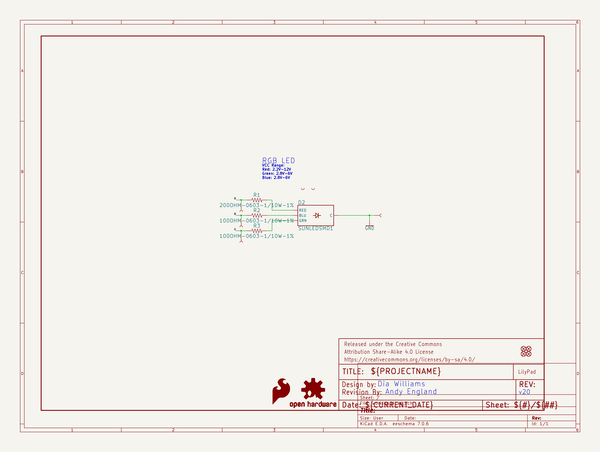
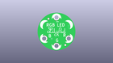
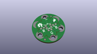
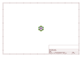
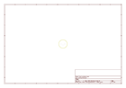
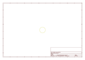
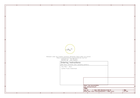

# OOMP Project  
## LilyPad_Tri-Color_LED  by sparkfun  
  
(snippet of original readme)  
  
SparkFun LilyPad RGB LED  
========================================  
  
  
  
[*SparkFun LilyPad RGB LED (DEV-13735)*](https://www.sparkfun.com/products/13735)  
  
Use the LilyPad RGB LED board as a simple indicator, or by pulsing the red, green, and blue channels, you can create any color.   
This is a common cathode design - to turn on a channel you simply need to connect each R/G/B pins to a power source in order to illuminate that channel.  
  
_Note: The original product name was called "LilyPad Tri-Color LED." V2.0 was renamed as the "LilyPad RGB LED."_  
  
Repository Contents  
-------------------  
* **/Firmware** - Arduino example code   
* **/Hardware** - All Eagle design files (.brd, .sch)  
  
Documentation  
--------------  
* **[SparkFun Fritzing repo](https://github.com/sparkfun/Fritzing_Parts)** - Fritzing diagrams for SparkFun products.  
* **[Hookup Guide](https://learn.sparkfun.com/tutorials/lilypad-rgb-led-hookup-guide)** - Basic hookup guide for the LilyPad RGB LED.  
  
Version History  
---------------  
* [v2.0](https://github.com/sparkfun/LilyPad_Tri-Color_LED/tree/v_2.0) - v2.0, common cathode  
* [v1.6](https://github.com/sparkfun/LilyPad_Tri-Color_LED/tree/v_1.6) - Initial Release, common anode  
  
License Information  
-------------------  
The hardware is released under [Creative Commons ShareAlike 4.0 International](https://creativecommons.org/licenses/by-sa/4.0/).  
  
A portion of this sale  
  full source readme at [readme_src.md](readme_src.md)  
  
source repo at: [https://github.com/sparkfun/LilyPad_Tri-Color_LED](https://github.com/sparkfun/LilyPad_Tri-Color_LED)  
## Board  
  
  
## Schematic  
  
  
  
[schematic pdf](working_schematic.pdf)  
## Images  
  
  
  
  
  
  
  
  
  
  
  
  
  
  
  
  
