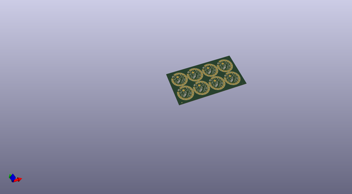
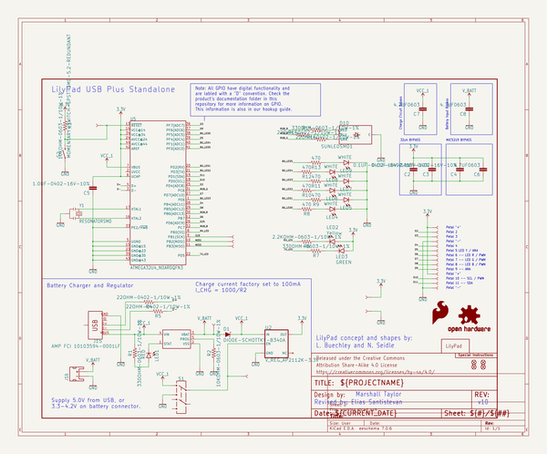
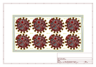
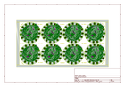
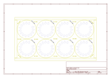
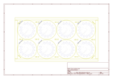
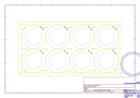
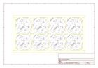

# OOMP Project  
## LilyPad_USB_Plus_Standalone  by sparkfun  
  
(snippet of original readme)  
  
SparkFun LilyPad USB Plus  
========================================  
  
  
  
[*LilyPad USB Plus (14631)*](https://www.sparkfun.com/products/14631)  
  
This is the LilyPad USB Plus, a sewable electronics microcontroller board controlled by an ATmega32U4 with the Arduino bootloader.   
  
Repository Contents  
-------------------  
  
* **/Documentation** - Data sheets, additional product information  
* **/Hardware** - Eagle design files (.brd, .sch)  
* **/Production** - Production panel files (.brd)  
  
<b>Note for Linux Users:</b> If you are installing the LilyPad USB Plus in Linux, this document has some specific notes:  
<a href="https://github.com/sparkfun/LilyPad_ProtoSnap_Plus/blob/master/Documentation/LinuxInstallation.md">https://github.com/sparkfun/LilyPad_ProtoSnap_Plus/blob/master/Documentation/LinuxInstallation.md</a>.  
  
Documentation  
--------------  
* **[Library](https://github.com/sparkfun/LilyPad_USB_Plus_Standalone/tree/master/Libraries)** - Arduino library for the LilyPad USB Plus.  
* **[Hookup Guide](https://learn.sparkfun.com/tutorials/lilypad-usb-plus-hookup-guide)** - Basic hookup guide for the LilyPad USB Plus.  
  
License Information  
-------------------  
  
This product is _**open source**_!   
  
Please review the LICENSE.md file for license information.   
  
If you have any questions or concerns on licensing, please contact techsupport@sparkfun.com.  
  
Distributed as-is; no warranty is given.  
  
- Your  
  full source readme at [readme_src.md](readme_src.md)  
  
source repo at: [https://github.com/sparkfun/LilyPad_USB_Plus_Standalone](https://github.com/sparkfun/LilyPad_USB_Plus_Standalone)  
## Board  
  
  
## Schematic  
  
  
  
[schematic pdf](working_schematic.pdf)  
## Images  
  
  
  
  
  
  
  
  
  
  
  
  
  
  
  
  
