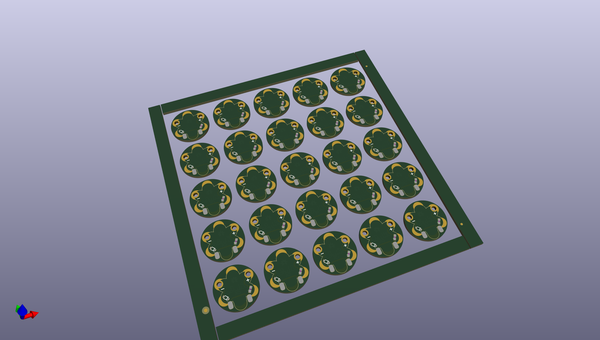
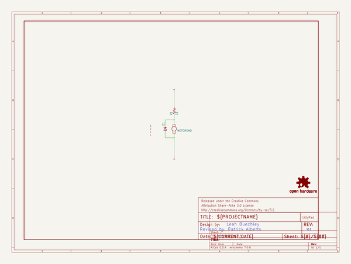
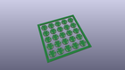
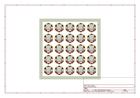
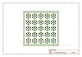
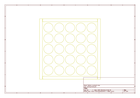
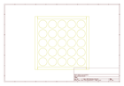
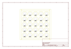

# OOMP Project  
## LilyPad_Vibe_Board  by sparkfun  
  
(snippet of original readme)  
  
LilyPad Vibe Board  
=================  
  
  
  
[*SparkFun LilyPad Vibe Board (DEV-11008)*](https://www.sparkfun.com/products/11008)  
  
Apply 5V and be shaken by this small, but powerful vibration motor. Works great as an physical indicator without notifying anyone but the wearer. This version uses a surface mount motor which is less likely to be damaged during use. When using with a 3.3V LilyPad Arduino, make sure to use a [transistor](https://www.sparkfun.com/products/11214) in order to source enough current.  
  
Repository Contents  
-------------------  
  
* **/Firmware** - Arduino example code  
* **/Hardware** - All Eagle design files (.brd, .sch)  
* **/Production** - Test bed files and production panel files  
  
Documentation  
--------------  
  
* **[LilyPad Vibe Board Hookup Guide](https://learn.sparkfun.com/tutorials/lilypad-vibe-board-hookup-guide)** - The LilyPad Vibe Board is a small vibration motor that can be sewn into projects with conductive thread and controlled by a LilyPad Arduino. The board can be used as a physical indicator on clothing and costumes for haptic feedback.  
* **[LilyPad Development Board Activity Guide: Thermal Alert Project](https://learn.sparkfun.com/tutorials/lilypad-development-board-activity-guide/11-thermal-alert-project)** - Example code using LilyPad Temperature Sensor to trigger the LilyPad Vibe Board when a certain temperature is reached.  
  
  
License Information  
---------  
  full source readme at [readme_src.md](readme_src.md)  
  
source repo at: [https://github.com/sparkfun/LilyPad_Vibe_Board](https://github.com/sparkfun/LilyPad_Vibe_Board)  
## Board  
  
  
## Schematic  
  
  
  
[schematic pdf](working_schematic.pdf)  
## Images  
  
  
  
  
  
  
  
  
  
  
  
  
  
  
  
  
