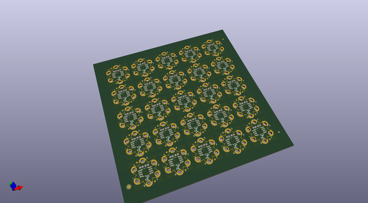
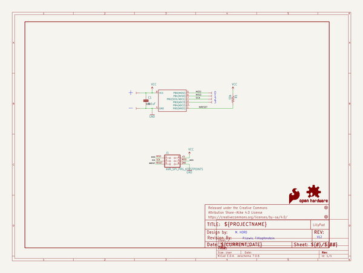
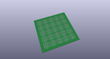
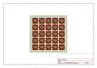
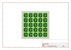
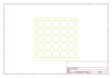
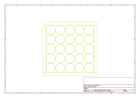
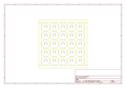

# OOMP Project  
## LilyTiny_LilyTwinkle  by sparkfun  
  
(snippet of original readme)  
  
LilyTiny / LilyTwinkle  
======================  
  
[    
*LilyTiny (DEV-10899)*](https://www.sparkfun.com/products/10899) / [*LilyTwinkle (DEV-11364)*](https://www.sparkfun.com/products/11364)  
  
LilyTiny and LilyTwinkle are ATtiny85-based development boards for eTextiles applications. Due to the small size of the board and hardware limitations of the processor, they do not have a bootloader like a conventional LilyPad Arduino compatible does. Instead, six pads are available in the center of the back side of the board, allowing it to be reprogrammed with a standard AVR ISP programmer simply by inserting male headers into the end of the programming cable and pressing them against the board.  
  
In order to write new code for the ATtiny you will need to add support to the Arduino IDE. Please refer to the High-Low Tech group at MIT for a great tutorial on doing this: [http://hlt.media.mit.edu/?p=1695](http://hlt.media.mit.edu/?p=1695)  
  
Repository Contents  
-------------------  
  
* **/Firmware** - Separate firmware files for the LilyTiny and the LilyTwinkle.  
* **/Fritzing** - Fritzing Example wiring images  
* **/Hardware** - All hardware files for both the LilyTiny *and* the LilyTwinkle (they are identical boards). For simplicity's sake, the hardware files are named *LilyTiny*.  
* **/Production** - Test bed files and production panel files  
  
Documentation  
--------------  
  
* Getting Started Tu  
  full source readme at [readme_src.md](readme_src.md)  
  
source repo at: [https://github.com/sparkfun/LilyTiny_LilyTwinkle](https://github.com/sparkfun/LilyTiny_LilyTwinkle)  
## Board  
  
  
## Schematic  
  
  
  
[schematic pdf](working_schematic.pdf)  
## Images  
  
  
  
  
  
  
  
  
  
  
  
  
  
  
  
  
