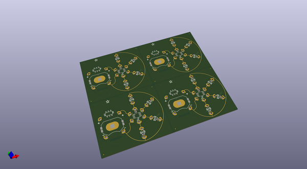
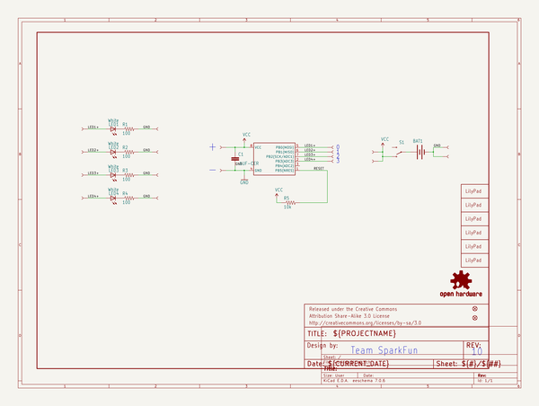
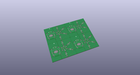
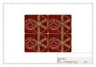
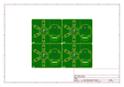
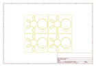
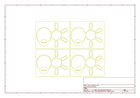
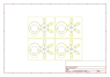

# OOMP Project  
## LilyTwinkle_ProtoSnap  by sparkfun  
  
oomp key: oomp_projects_flat_sparkfun_lilytwinkle_protosnap  
(snippet of original readme)  
  
LilyTwinkle ProtoSnap  
=====================  
  
  
  
[*SparkFun LilyTwinkle ProtoSnap (DEV-11590)*](https://www.sparkfun.com/products/11590)  
  
The ProtoSnap LilyTwinkle board is a very simple way to jump right into e-textiles. By including the LilyTwinkle, a   
coin cell battery holder (with built-in switch), and four white LEDs the ProtoSnap LilyTwinkle board easily allows   
you to add some sparkle to any project.  
  
Repository Contents  
-------------------  
* **/Hardware** - All Eagle design files (.brd, .sch)  
* **/Production** - Test bed files and production panel files  
  
Documentation  
--------------  
  
* Getting Started Tutorials  
  * **[LDK Experiment 6: Microcontroller Circuits](https://learn.sparkfun.com/tutorials/ldk-experiment-6-microcontroller-circuits)**  
  * **[Using the LilyPad LilyTwinkle board](https://www.sparkfun.com/tutorials/390)**  
* Project Tutorials -- Example projects using the LilyTiny and LilyTwinkle  
  * **[Twinkle Zodiac Constellation](https://learn.sparkfun.com/tutorials/twinkle-zodiac-constellation)**  
  * **[Night Sky Halloween Costume](https://learn.sparkfun.com/tutorials/night-sky-halloween-costume)**  
  * **[Firefly Jar Assembly Guide](https://learn.sparkfun.com/tutorials/firefly-jar-assembly-guide)**   
  * **[Soft Circuits: LED Feelings Pizza](https://learn.sparkfun.com/tutorials/soft-circuits-led-feelings-pizza)**  
  * **[Twinkling Trick or Treat Bag](https://learn.sparkfun  
  full source readme at [readme_src.md](readme_src.md)  
  
source repo at: [https://github.com/sparkfun/LilyTwinkle_ProtoSnap](https://github.com/sparkfun/LilyTwinkle_ProtoSnap)  
## Board  
  
  
## Schematic  
  
  
  
[schematic pdf](working_schematic.pdf)  
## Images  
  
  
  
  
  
  
  
  
  
  
  
  
  
  
  
  
