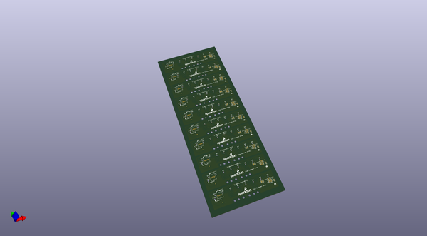
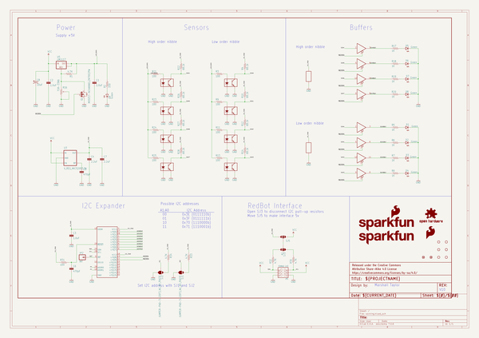
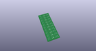
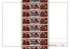
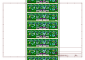
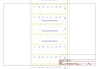
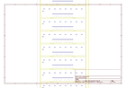
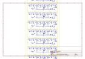
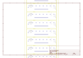

# OOMP Project  
## Line_Follower_Array  by sparkfun  
  
oomp key: oomp_projects_flat_sparkfun_line_follower_array  
(snippet of original readme)  
  
SparkFun Line Follower Array  
========================================  
  
  
  
[*SparkFun Line Follower Array (SEN-13582)*](https://www.sparkfun.com/products/13582)  
  
The Sensor Bar takes an 8 bit reading of reflectance for use with following lines or reading dark/light patterns.  The bar can see from about 1/4 to 3/4 inches away.  IR illumination power can be adjusted with the on-board potentiometer.  Illumination can be turned on and off with software to conserve power, or left on all the time for faster readings.  
  
Repository Contents  
-------------------  
  
* **/Documentation** - Data sheets, additional product information  
* **/Hardware** - Eagle design files (.brd, .sch)  
* **/Libraries** - Libraries for use with the RedBot Line Follower Sensor Bar  
* **/Production** - Production panel files (.brd)  
  
Documentation  
--------------  
* **[Library](https://github.com/sparkfun/SparkFun_Line_Follower_Array_Arduino_Library)** - Arduino library for the array.  
* **[Hookup Guide](https://learn.sparkfun.com/tutorials/sparkfun-line-follower-array-hookup-guide)** - Basic hookup guide for the array.  
  
Product Versions  
----------------  
* [*SparkFun Line Follower Array (SEN-13582)*](https://www.sparkfun.com/products/13582)  
  
  
Version History  
---------------  
* [V_0.4.0](https://github.com/sparkfun/Line_  
  full source readme at [readme_src.md](readme_src.md)  
  
source repo at: [https://github.com/sparkfun/Line_Follower_Array](https://github.com/sparkfun/Line_Follower_Array)  
## Board  
  
  
## Schematic  
  
  
  
[schematic pdf](working_schematic.pdf)  
## Images  
  
  
  
  
  
  
  
  
  
  
  
  
  
  
  
  
