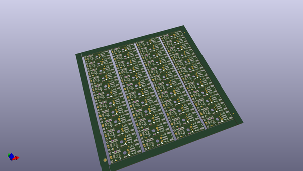
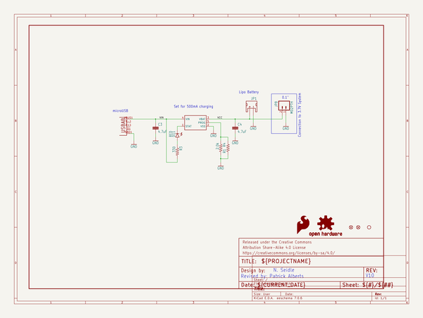
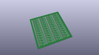
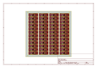
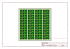
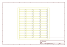
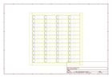
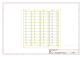
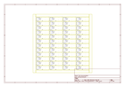

# OOMP Project  
## Lipo_Charger_Basic-microUSB  by sparkfun  
  
oomp key: oomp_projects_flat_sparkfun_lipo_charger_basic_microusb  
(snippet of original readme)  
  
SparkFun LiPo Charger Basic - Micro-USB  
========================================  
  
  
  
[*SparkFun LiPo Charger Basic - Micro-USB (PRT-10217)*](https://www.sparkfun.com/products/10217)  
  
The SparkFun LiPo Charger Basic is stripped down of all features and just does one thing well - charge 3.7V LiPo cells at a rate of 500mA.   
It is designed to charge single-cell Li-Ion or Li-Polymer batteries.   
The board incorporates a charging circuit, status LED, connector for your battery (JST-type used in the batteries we carry), and a micro-USB connector.   
A small mounting hole allows this charger to be easily embedded into a project.  
  
Repository Contents  
-------------------  
* **/Hardware** - Eagle design files (.brd, .sch)  
* **/Production** - Production panel files (.brd)  
  
Documentation  
--------------  
* **[SparkFun Fritzing repo](https://github.com/sparkfun/Fritzing_Parts)** - Fritzing diagrams for SparkFun products.  
* **[SparkFun 3D Model repo](https://github.com/sparkfun/3D_Models)** - 3D models of SparkFun products.   
  
License Information  
-------------------  
This product is _**open source**_!   
  
The **hardware** is released under [Creative Commons ShareAlike 4.0 International](https://creativecommons.org/licenses/by-sa/4.0/).  
  
Please use, reuse, and modify these files as you see fit. Please maintain attribution to SparkFun Electronics and release anything derivative under the same license.  
  full source readme at [readme_src.md](readme_src.md)  
  
source repo at: [https://github.com/sparkfun/Lipo_Charger_Basic-microUSB](https://github.com/sparkfun/Lipo_Charger_Basic-microUSB)  
## Board  
  
  
## Schematic  
  
  
  
[schematic pdf](working_schematic.pdf)  
## Images  
  
  
  
  
  
  
  
  
  
  
  
  
  
  
  
  
