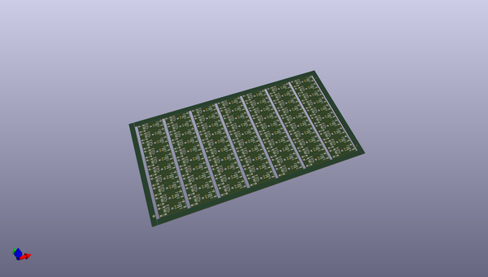
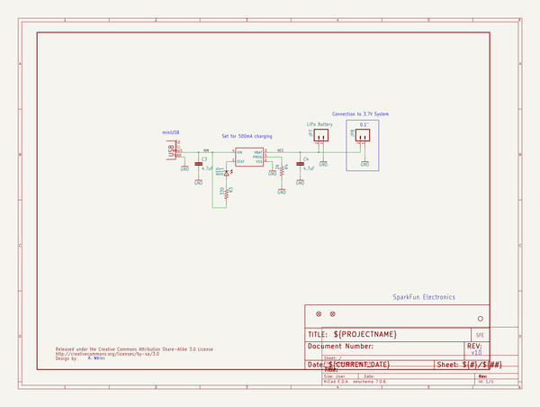
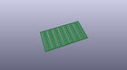
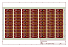
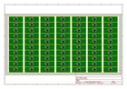
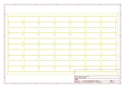
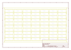
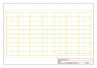
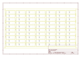

# OOMP Project  
## Lipo_Charger_Basic-miniUSB  by sparkfun  
  
oomp key: oomp_projects_flat_sparkfun_lipo_charger_basic_miniusb  
(snippet of original readme)  
  
SparkFun Lipo Charger Basic - miniUSB  
=======================================  
  
  
[*SparkFun Lipo Charger Basic - miniUSB (PRT-10401)*](https://www.sparkfun.com/products/10401)  
  
If you need to charge LiPo batteries, this simple charger will do just that. It is designed to charge single-cell Li-Ion or Li-Polymer batteries.  
The board incorporates a charging circuit, status LED, connector for your battery (JST-type used in the batteries we carry), and a mini-USB connector.  
  
Repository Contents  
-------------------  
* **/Hardware** - All Eagle design files (.brd, .sch)  
  
  
License Information  
-------------------  
The hardware is released under [Creative Commons ShareAlike 4.0 International](https://creativecommons.org/licenses/by-sa/4.0/).  
  
Distributed as-is; no warranty is given.  
  
  full source readme at [readme_src.md](readme_src.md)  
  
source repo at: [https://github.com/sparkfun/Lipo_Charger_Basic-miniUSB](https://github.com/sparkfun/Lipo_Charger_Basic-miniUSB)  
## Board  
  
  
## Schematic  
  
  
  
[schematic pdf](working_schematic.pdf)  
## Images  
  
  
  
  
  
  
  
  
  
  
  
  
  
  
  
  
