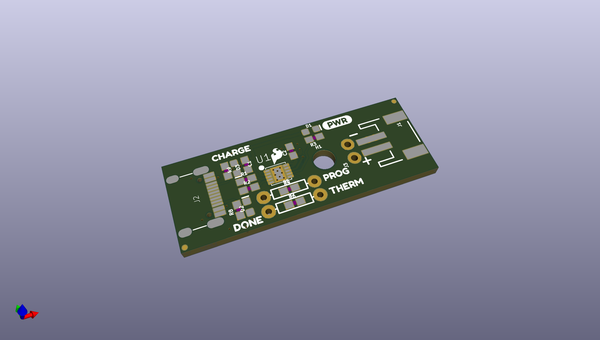
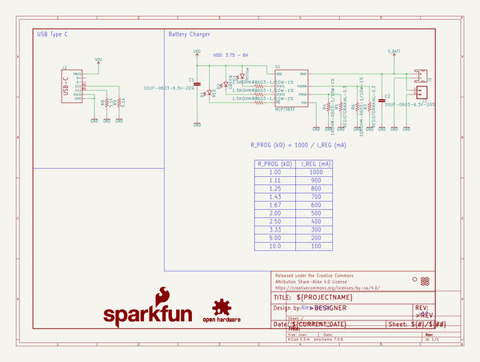
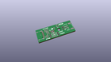
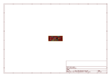
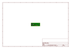
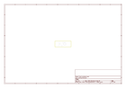
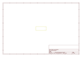
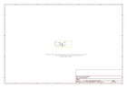

# OOMP Project  
## LiPo_Charger_Plus  by sparkfun  
  
(snippet of original readme)  
  
SparkFun LiPo Charger Plus  
========================================  
  
  
  
[*SparkFun LiPo Charger Plus (PRT-15217)*](https://www.sparkfun.com/products/15217)  
  
The SparkFun LiPo Charger Plus is the souped-up power option in the SparkFun line of single-cell lithium polymer (LiPo) battery chargers. With this iteration, we've changed the input charge connector to USB-C and provided charge rate selection as well as optional thermal protection. Charge, power, and done LEDs clearly indicate the status of your charging process. This board can be used for any of the 2-pin JST connector single cell LiPo batteries we carry.   
  
With an input voltage between 3.75V-6V, the MCP73833 can charge up to a maximum rate of 1000mAh and provides two forms of thermal protection. An internal sensor maintains maximum charging rate until the die temperature of the IC reaches ~95°C; the charge controller will then reduce the charge rate to prevent overheating. The MCP73833 also has an optional input pin for an NTC (negative-temperature coefficient) thermistor, thus gating the battery against possible damage.   
  
  
  
Repository Contents  
-------------------  
  
* **/Hardware** - Eagle design files (.brd, .sch)  
  
Documentation  
--------------  
* **[SparkFun Fritzing Part](https://github.com/sparkfun/Fritzing_Parts/blob/main/products/15217_sfe_LiPo_Charger_Plus.fzpz)** - Fritzing diagrams for SparkFun pro  
  full source readme at [readme_src.md](readme_src.md)  
  
source repo at: [https://github.com/sparkfun/LiPo_Charger_Plus](https://github.com/sparkfun/LiPo_Charger_Plus)  
## Board  
  
  
## Schematic  
  
  
  
[schematic pdf](working_schematic.pdf)  
## Images  
  
  
  
  
  
  
  
  
  
  
  
  
  
  
  
  
