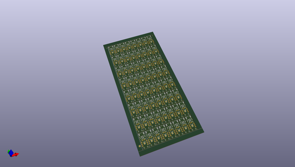
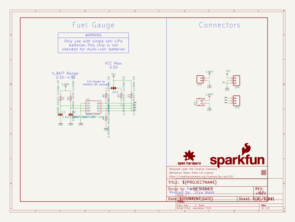
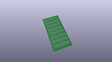
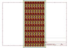
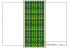
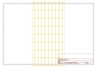
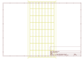
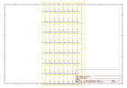
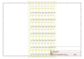

# OOMP Project  
## Lipo_Fuel_Gauge  by sparkfun  
  
(snippet of original readme)  
  
SparkFun LiPo Fuel Gauge - MAX17043  
========================================  
  
  
  
[*SparkFun LiPo Fuel Gauge (TOL-20680)*](https://www.sparkfun.com/products/20680)  
  
LiPo batteries are a great way to power your projects. They're small, lightweight, and pack a good punch for their size. Unfortunately, even the best batteries eventually run low on power, and when they do it's often unexpected (and at the worst time). Don't be caught by surprise next time your board suddenly powers down!   
  
The SparkFun LiPo Fuel Gauge connects your battery to your project and uses a sophisticated algorithm to detect the relative state of charge and direct A/D measurement of battery voltage. In other words, it tells your microcontroller how much 'fuel' is left in the tank. The LiPo Fuel Gauge communicates with your project over I2C and an alert pin also tells you when the charge has dropped below a certain percentage.  
  
Repository Contents  
-------------------  
  
* **/Firmware** - Example C code   
* **/Hardware** - Eagle design files (.brd, .sch)  
* **/Production** - Production panel files (.brd)  
  
  
  
Documentation  
--------------  
* **[Particle Photon Library](https://github.com/sparkfun/SparkFun_MAX17043_Particle_Library)** - Particle Library for the MAX17043 that is used in the [SparkFun Photon Battery Shield](https://www.sparkfun.com  
  full source readme at [readme_src.md](readme_src.md)  
  
source repo at: [https://github.com/sparkfun/Lipo_Fuel_Gauge](https://github.com/sparkfun/Lipo_Fuel_Gauge)  
## Board  
  
  
## Schematic  
  
  
  
[schematic pdf](working_schematic.pdf)  
## Images  
  
  
  
  
  
  
  
  
  
  
  
  
  
  
  
  
