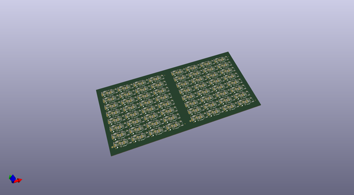
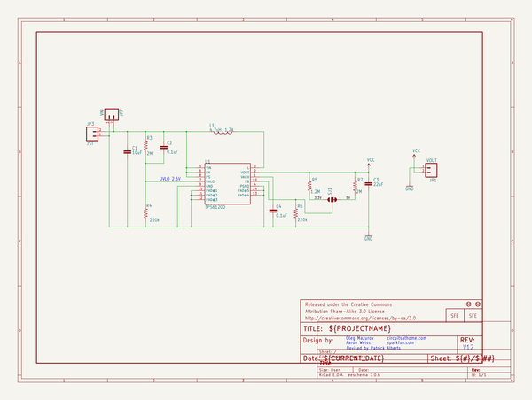
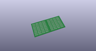
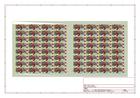
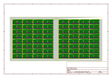
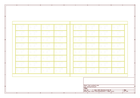
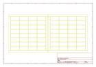
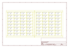

# OOMP Project  
## LiPower_Boost_Converter  by sparkfun  
  
oomp key: oomp_projects_flat_sparkfun_lipower_boost_converter  
(snippet of original readme)  
  
LiPower - Boost Converter  
========================  
  
[  
*LiPower - Boost Converter (PRT-10255)*](https://www.sparkfun.com/products/10255)  
  
This board is based on the TPS61200 boost converter. The board is configured to work with a LiPo battery, has a  
solder jumper selectable between 5V and 3.3V output, and an under voltage protection of 2.6V.   
  
Repository Contents  
-------------------  
* **/Hardware** - All Eagle design files (.brd, .sch, .STL)  
* **/Production** - Test bed files and production panel files  
  
License Information  
-------------------  
The hardware is released under [Creative Commons ShareAlike 4.0 International](https://creativecommons.org/licenses/by-sa/4.0/).  
  
Distributed as-is; no warranty is given.  
  
  full source readme at [readme_src.md](readme_src.md)  
  
source repo at: [https://github.com/sparkfun/LiPower_Boost_Converter](https://github.com/sparkfun/LiPower_Boost_Converter)  
## Board  
  
  
## Schematic  
  
  
  
[schematic pdf](working_schematic.pdf)  
## Images  
  
  
  
  
  
  
  
  
  
  
  
  
  
  
  
  
