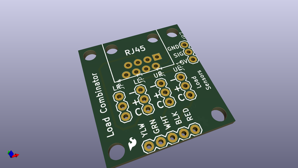
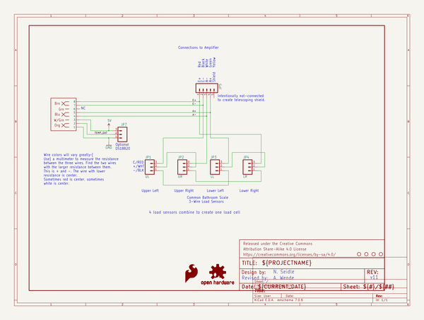

# OOMP Project  
## Load_Sensor_Combinator  by sparkfun  
  
oomp key: oomp_projects_flat_sparkfun_load_sensor_combinator  
(snippet of original readme)  
  
SparkFun Load Sensor Combinator  
=============================  
  
  
  
[*SparkFun Load Sensor Combinator (BOB-13281)*](https://www.sparkfun.com/products/13281)  
  
Repository Contents  
-------------------  
* **/Hardware** - Eagle design files (.brd, .sch)  
  
Documentation  
--------------  
* **[Hookup Guide](https://learn.sparkfun.com/tutorials/load-cell-amplifier-hx711-breakout-hookup-guideL)** - Basic hookup guide.  
* **[SparkFun Fritzing repo](https://github.com/sparkfun/Fritzing_Parts)** - Fritzing diagrams for SparkFun products.  
* **[SparkFun 3D Model repo](https://github.com/sparkfun/3D_Models)** - 3D models of SparkFun products.   
  
How to Use  
----------  
  
  
  
  
If you open up an electronic bathroom scale you’ll find a large rats nest of wires. The Load Sensor Combinator was created to combine the 12 wires found in a bathroom scale into the standard 4-wires that wheatstone bridge configuration.  
  
This board also works with four of our individual [load sensors](https://www.sparkfun.com/products/10245). If you aren’t mechanically inclined we recommend purchasing an off-the-shelf bathroom scale and hacking the combinator into it rather than trying to design a base to properly mount fo  
  full source readme at [readme_src.md](readme_src.md)  
  
source repo at: [https://github.com/sparkfun/Load_Sensor_Combinator](https://github.com/sparkfun/Load_Sensor_Combinator)  
## Board  
  
  
## Schematic  
  
  
  
[schematic pdf](working_schematic.pdf)  
## Images  
