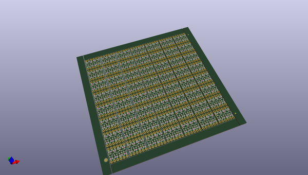
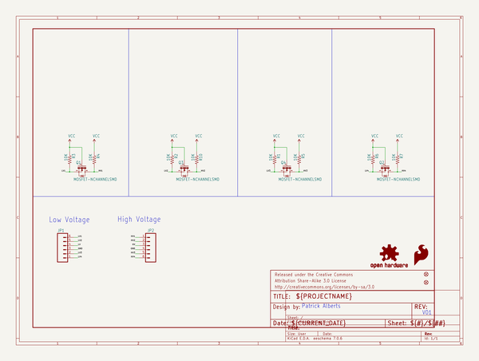
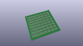
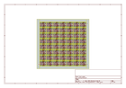
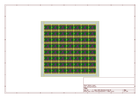
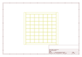
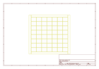
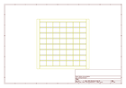
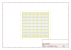

# OOMP Project  
## Logic_Level_Bidirectional  by sparkfun  
  
oomp key: oomp_projects_flat_sparkfun_logic_level_bidirectional  
(snippet of original readme)  
  
Logic Level Converter Bidirectional  
=========================  
  
  
  
[*Logic Level Converter Bi-Directional (BOB-12009)*](https://www.sparkfun.com/products/12009)  
  
This is a bidirectional logic level converter that allows you to communicate between 3.3V and 5V devices, or 2.8V and 1.8V devices.  
  
  
Repository Contents  
-------------------  
* **/Hardware** - All Eagle design files (.brd, .sch, .STL)  
* **/Production** - Test bed files and production panel files  
  
Documentation  
--------------  
* **[Hookup Guide](https://learn.sparkfun.com/tutorials/bi-directional-logic-level-converter-hookup-guide)** - Basic hookup guide  
* **[SparkFun Fritzing repo](https://github.com/sparkfun/Fritzing_Parts)** - Fritzing diagrams for SparkFun products.  
  
License Information  
-------------------  
The hardware is released under [Creative Commons Share-alike 3.0](http://creativecommons.org/licenses/by-sa/3.0/).    
  
  full source readme at [readme_src.md](readme_src.md)  
  
source repo at: [https://github.com/sparkfun/Logic_Level_Bidirectional](https://github.com/sparkfun/Logic_Level_Bidirectional)  
## Board  
  
  
## Schematic  
  
  
  
[schematic pdf](working_schematic.pdf)  
## Images  
  
  
  
  
  
  
  
  
  
  
  
  
  
  
  
  
