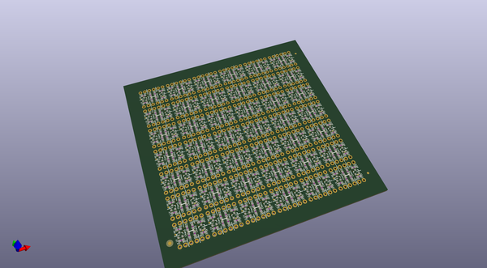
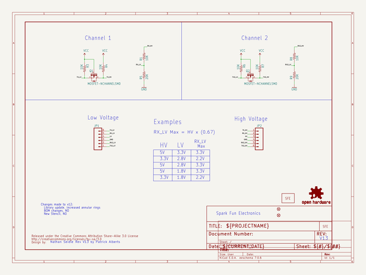
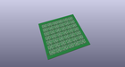
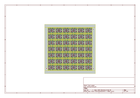
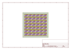
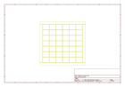
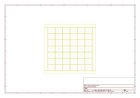
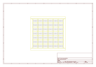

# OOMP Project  
## Logic_Level_Converter  by sparkfun  
  
(snippet of original readme)  
  
**NOTE:** *This product has been retired from our catalog. For a more up-to-date version, try looking at the [bi-directional logic level converter](https://www.sparkfun.com/products/12009).*  
  
*If you are looking for more up-to-date info, please check out some of these resources to see how other users are still hacking and improving on this product.*  
  
* *[SparkFun Forum](https://forum.sparkfun.com/)*  
* *[Comments Here on GitHub](https://github.com/sparkfun/Logic_Level_Converter/issues)*  
* *[IRC Channel](https://www.sparkfun.com/news/263)*  
  
Logic Level Converter  
=====================  
  
  
  
[*Logic Level Converter*](https://www.sparkfun.com/products/11978)  
  
Design files for the [Logic Level Converter board](https://www.sparkfun.com/products/11978).  
  
Repository Contents  
-------------------  
  
* **/hardware** - Eagle PCB layout files  
* **/Production Files** - Files to support SparkFun production  
  
Documentation  
--------------  
* **[Hookup Guide](https://learn.sparkfun.com/tutorials/retired---using-the-logic-level-converter)** - Basic hookup guide  
  
License Information  
-------------------  
  
All contents of this repository are released under [Creative Commons Share-alike 3.0](http://creativecommons.org/licenses/by-sa/3.0/).  
  
  full source readme at [readme_src.md](readme_src.md)  
  
source repo at: [https://github.com/sparkfun/Logic_Level_Converter](https://github.com/sparkfun/Logic_Level_Converter)  
## Board  
  
  
## Schematic  
  
  
  
[schematic pdf](working_schematic.pdf)  
## Images  
  
  
  
  
  
  
  
  
  
  
  
  
  
  
  
  
