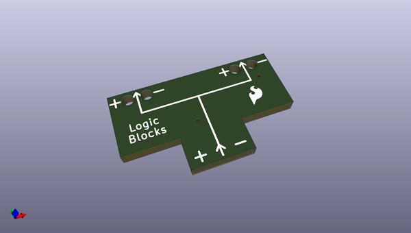
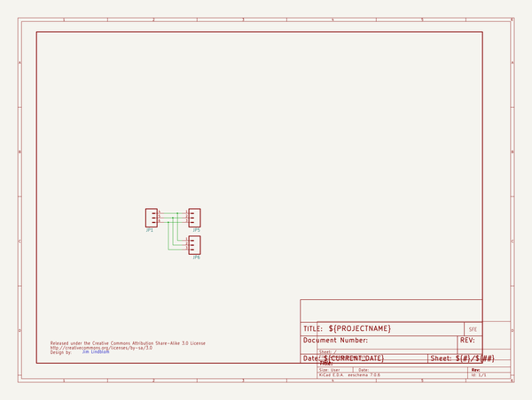

# OOMP Project  
## LogicBlocks  by sparkfun  
  
(snippet of original readme)  
  
LogicBlocks Kit  
============================  
  
  
[    
*LogicBlocks Kit (KIT-11006)*](https://www.sparkfun.com/products/11006)  
  
LogicBlocks allow you to play with logic gates by literally plugging one into another and watching the progression of an input to an output! Each LogicBlock represents a different logic function: the NOT block is a simple inverter, where the output is the opposite of the input. The AND block will only output a 1 if both of the inputs are 1. The OR block will output a 1 if either of the inputs are 1. There are also input blocks and splitter blocks.  
  
Repository Contents  
-------------------  
* **/Hardware** - All Eagle design files (.brd, .sch)  
  
License Information  
-------------------  
The hardware is released under [Creative Commons ShareAlike 4.0 International](https://creativecommons.org/licenses/by-sa/4.0/).  
  
Distributed as-is; no warranty is given.  
  
  full source readme at [readme_src.md](readme_src.md)  
  
source repo at: [https://github.com/sparkfun/LogicBlocks](https://github.com/sparkfun/LogicBlocks)  
## Board  
  
  
## Schematic  
  
  
  
[schematic pdf](working_schematic.pdf)  
## Images  
