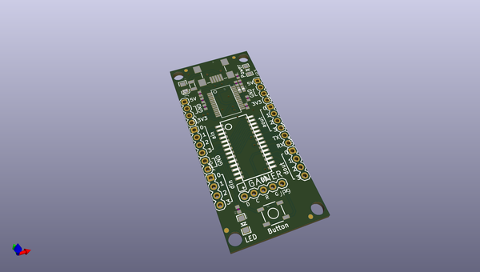

# OOMP Project  
## Logomatic  by sparkfun  
  
(snippet of original readme)  
  
Logomatic v2 Serial SD Datalogger (FAT32)  
========================================  
  
[    
*Logomatic v2 FAT32(WIG-12772)*](https://www.sparkfun.com/products/12772)  
  
The Logomatic is a great data logger that appears as a flash drive on any operating system. Logs are created  
in FAT32 format on the microSD media and can be downloaded quickly over a USB connection by dragging and dropping   
the text files from the device. The board has a built-in RTC and 10 available GPIO pins.   
  
Repository Contents  
-------------------  
* **/Firmware** - Firmware that comes pre-installed on the Logomatic  
* **/Hardware** - All Eagle design files (.brd, .sch)  
* **/Production** - Test bed files and production panel files  
  
Documentation  
--------------  
* **[Hookup Guide](https://learn.sparkfun.com/tutorials/logomatic-hookup-guide/)** - Basic hookup guide for the Logomatic v2.  
  
Product Versions  
----------------  
* [WIG-12772](https://www.sparkfun.com/products/12772)- Logomatic v2 with micro-B USB connector and FAT32 programming.   
* *[WIG-10216 (RETIRED)](https://www.sparkfun.com/products/10216)- Logomatic v2 with mini-B USB connector and FAT16 programming.*  
  
License Information  
-------------------  
The hardware is released under [Creative Commons ShareAlike 4.0 International](https://creativecommons.org/licenses/by-sa/4.0/).  
The code is beerware; if you see me (or any other SparkFun employee) at the local, and you've found o  
  full source readme at [readme_src.md](readme_src.md)  
  
source repo at: [https://github.com/sparkfun/Logomatic](https://github.com/sparkfun/Logomatic)  
## Board  
  
  
## Schematic  
  
  
  
[schematic pdf](working_schematic.pdf)  
## Images  
