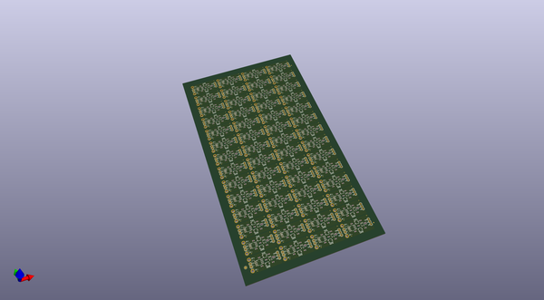
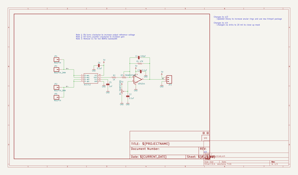
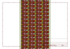
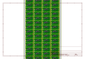
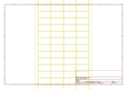
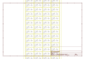

# OOMP Project  
## Low_Current_Sensor_Breakout-ACS712  by sparkfun  
  
oomp key: oomp_projects_flat_sparkfun_low_current_sensor_breakout_acs712  
(snippet of original readme)  
  
**NOTE:** *This product has been retired from our catalog. There is an updated drop-in replacement with the ACS723 available: [SEN-14544](https://github.com/sparkfun/Current_Sensor_Breakout-ACS723-Low_Current). If you are looking for more up-to-date info, please check out some of these resources to see how other users are still hacking and improving on this product version.*  
  
* *[SparkFun Forum](https://forum.sparkfun.com/)*  
* *[Comments Here on GitHub](https://github.com/sparkfun/Low_Current_Sensor_Breakout-ACS712/issues)*  
* *[IRC Channel](https://www.sparkfun.com/news/263)*  
  
SparkFun Low Current Sensor Breakout Board - ACS712  
======================================================  
  
  
  
[*SparkFun Low Current Sensor Breakout Board - ACS712 (SEN-08883)*](https://www.sparkfun.com/products/8883)   
  
This current sensor gives precise current measurement for both AC and DC signals.   
These are good sensors for metering and measuring overall power consumption of systems.  
The ACS712 Low Current Sensor Breakout outputs an analog voltage that varies linearly with sensed current.  
  
Repository Contents  
-------------------  
* **/Hardware** - All Eagle design files (.brd, .sch)  
  
Documentation  
--------------  
* **[Hookup Guide](https://learn.sparkfun.com/tutorials/acs712-low-current-sensor-hookup-guide)** - Basic hookup guide for the ACS712.  
  
Product Versions  
----------------  
  
* [SEN-0  
  full source readme at [readme_src.md](readme_src.md)  
  
source repo at: [https://github.com/sparkfun/Low_Current_Sensor_Breakout-ACS712](https://github.com/sparkfun/Low_Current_Sensor_Breakout-ACS712)  
## Board  
  
  
## Schematic  
  
  
  
[schematic pdf](working_schematic.pdf)  
## Images  
  
  
  
  
  
  
  
  
  
  
  
  
  
  
  
  
