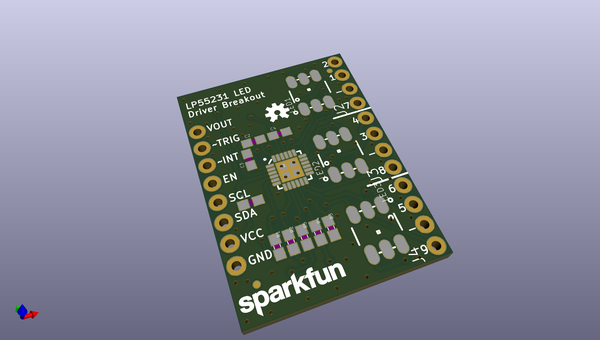
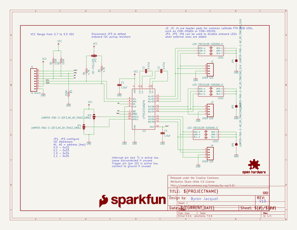
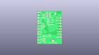
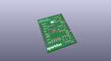
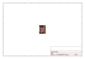
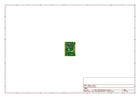
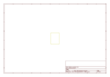
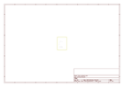
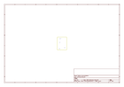
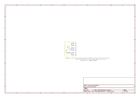

# OOMP Project  
## LP55231_Breakout  by sparkfun  
  
(snippet of original readme)  
  
SparkFun LP55231 LED Driver Breakout  
========================================  
  
  
  
[*SparkFun LP55231 LED Driver Breakout (BOB-13884)*](https://www.sparkfun.com/products/13884)  
  
Breakout Board for the Texas Instruments LP55231 9-channel LED driver IC, with three onboard RGB LEDs.  
  
Repository Contents  
-------------------  
  
* **/Documentation** - LP55231 data sheet.  
* **/Enclosure** - Enclosure files  
* **/Firmware** - Some test sketches.  For more useful sketches, please refer to the [LP55231 Arduino Library](https://github.com/sparkfun/SparkFun_LP55231_Arduino_Library)  
* **/Hardware** - Eagle design files (.brd, .sch)  
* **/Libraries** - work-in-progress libraries.  Release library has [its own repository](https://github.com/sparkfun/SparkFun_LP55231_Arduino_Library)  
* **/Production** - Production panel files (.brd)  
* **/Software** - Related software for the <PRODUCT NAME>  
  
Documentation  
--------------  
* **[Library](https://github.com/sparkfun/SparkFun_LP55231_Arduino_Library)** - Arduino library for the LP55231 breakout board.  
* **[Hookup Guide](https://learn.sparkfun.com/tutorials/lp55231-breakout-board-hookup-guide)** - Basic hookup guide for the LP55231 breakout.  
* **[SparkFun Fritzing repo](https://github.com/sparkfun/Fritzing_Parts)** - Fritzing diagrams for SparkFun products.  
* **[SparkFun 3D Model repo](https://github.com/sparkfun/3D_Models)** - 3D models of SparkFun prod  
  full source readme at [readme_src.md](readme_src.md)  
  
source repo at: [https://github.com/sparkfun/LP55231_Breakout](https://github.com/sparkfun/LP55231_Breakout)  
## Board  
  
  
## Schematic  
  
  
  
[schematic pdf](working_schematic.pdf)  
## Images  
  
  
  
  
  
  
  
  
  
  
  
  
  
  
  
  
