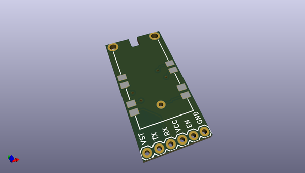
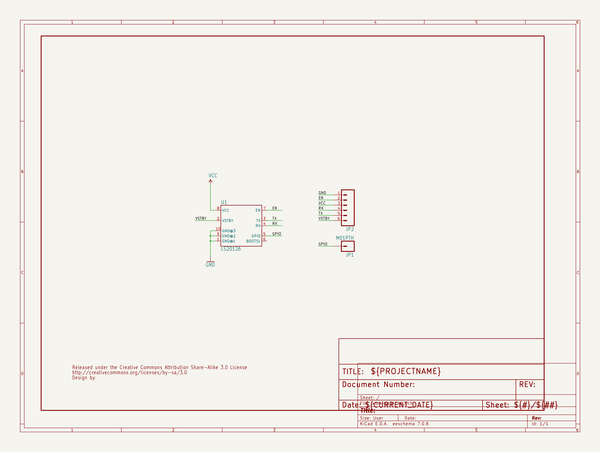
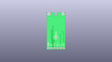
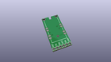
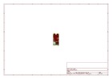
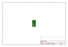
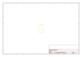
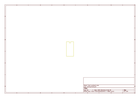
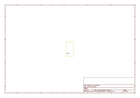
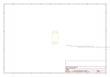

# OOMP Project  
## LS20126_GPS_Breakout  by sparkfun  
  
oomp key: oomp_projects_flat_sparkfun_ls20126_gps_breakout  
(snippet of original readme)  
  
**NOTE:** *This product has been retired from our catalog. If you are looking for more up-to-date info, please check out some of these resources to see how other users are still hacking and improving on this product.*  
* *[SparkFun Forum](https://forum.sparkfun.com/)*  
* *[Comments Here on GitHub](https://github.com/sparkfun/LS20126_GPS_Breakout/issues)*  
* *[IRC Channel](https://www.sparkfun.com/news/263)*  
  
LS20126 GPS Breakout  
====================  
  
  
  
[*SparkFun LS20126 GPS Breakout (BOB-10141)*](https://www.sparkfun.com/products/10141)  
  
This pcb breaks out the [LS20126 GPS receiver](https://www.sparkfun.com/products/retired/9838) pins to standard 0.1" headers.   
  
Repository Contents  
-------------------  
* **/Hardware** - All Eagle design files (.brd, .sch)  
  
  
License Information  
-------------------  
The hardware is released under [Creative Commons ShareAlike 4.0 International](https://creativecommons.org/licenses/by-sa/4.0/).  
  
Distributed as-is; no warranty is given.  
  
  full source readme at [readme_src.md](readme_src.md)  
  
source repo at: [https://github.com/sparkfun/LS20126_GPS_Breakout](https://github.com/sparkfun/LS20126_GPS_Breakout)  
## Board  
  
  
## Schematic  
  
  
  
[schematic pdf](working_schematic.pdf)  
## Images  
  
  
  
  
  
  
  
  
  
  
  
  
  
  
  
  
