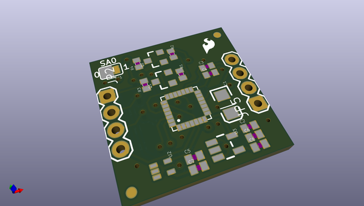
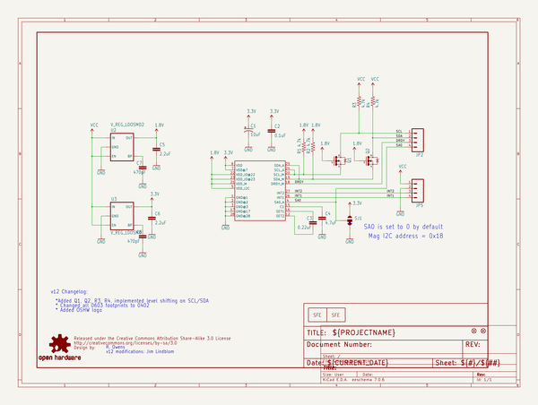
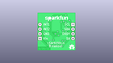
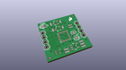
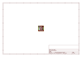
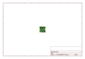
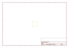
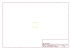
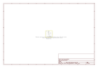

# OOMP Project  
## LSM303_Breakout  by sparkfun  
  
oomp key: oomp_projects_flat_sparkfun_lsm303_breakout  
(snippet of original readme)  
  
**NOTE:** *This product has been retired from our catalog. If you are looking for more up-to-date info, please check out some of these resources to see how other users are still hacking and improving on this product.*  
* *[SparkFun Forum](https://forum.sparkfun.com/)*  
* *[IRC Channel](https://www.sparkfun.com/news/263)*  
  
LSM303DLMTR Breakout Board  
===========================  
  
[  
*LSM303DLMTR Breakout Board (SEN-10888)*](https://www.sparkfun.com/products/10888)  
  
The LSM303DLMTR is a triple axis accelerometer and triple axis magnetic sensor, providing 6D of orientation detection.  
  
There is example code available [here](https://github.com/pololu/lsm303-arduino).  
  
Repository Contents  
-------------------  
* **/Hardware** - All Eagle design files (.brd, .sch)  
  
License Information  
-------------------  
The hardware is released under [Creative Commons Share-alike 3.0](http://creativecommons.org/licenses/by-sa/3.0/).    
  
  full source readme at [readme_src.md](readme_src.md)  
  
source repo at: [https://github.com/sparkfun/LSM303_Breakout](https://github.com/sparkfun/LSM303_Breakout)  
## Board  
  
  
## Schematic  
  
  
  
[schematic pdf](working_schematic.pdf)  
## Images  
  
  
  
  
  
  
  
  
  
  
  
  
  
  
  
  
