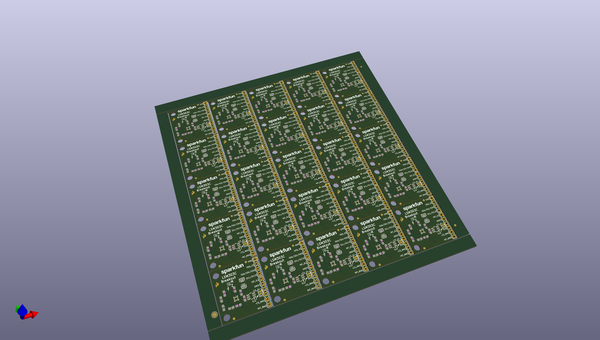
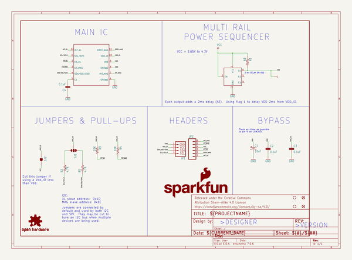
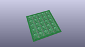
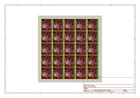
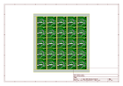
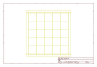
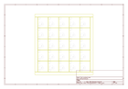
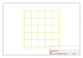
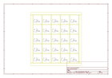

# OOMP Project  
## LSM303C_6_DOF_IMU_Breakout  by sparkfun  
  
(snippet of original readme)  
  
SparkFun LSM303C 6 DOF IMU Breakout  
========================================  
  
  
  
*[SparkFun LSM303C 6 DOF IMU Breakout (BOB-13303)](https://www.sparkfun.com/products/13303)*  
  
The LSM303C is a triple axis accelerometer and triple axis magnetic sensor, providing 6D of orientation detection.  
  
This part was created in Eagle v7.4.0  
  
Repository Contents  
-------------------  
  
* **/Hardware** - All Eagle design files (.brd, .sch)  
* **/Libraries** - All Arduino libraries and board examples  
* **/Production** - Test bed files and production panel files  
  
Documentation  
--------------  
* **[Arduino Library](https://github.com/sparkfun/SparkFun_LSM303C_6_DOF_IMU_Breakout_Arduino_Library)** - Arduino library for the LSM303C.  
* **[Hookup Guide](https://learn.sparkfun.com/tutorials/lsm303c-6dof-hookup-guide)** - Basic hookup guide for the LSM303C.  
* **[SparkFun Fritzing repo](https://github.com/sparkfun/Fritzing_Parts)** - Fritzing diagrams for SparkFun products.  
* **[SparkFun 3D Model repo](https://github.com/sparkfun/3D_Models)** - 3D models of SparkFun products.   
* **[SparkFun Graphical Datasheets](https://github.com/sparkfun/Graphical_Datasheets)** -Graphical Datasheets for various SparkFun products  
  
Product Versions  
----------------  
* [BOB-13303](https://www.sparkfun.com/products/13303)- LSM303C based 6 DOF IMU beakout board  
  
Version History  
---------------  
* [v1.0_H1.0  
  full source readme at [readme_src.md](readme_src.md)  
  
source repo at: [https://github.com/sparkfun/LSM303C_6_DOF_IMU_Breakout](https://github.com/sparkfun/LSM303C_6_DOF_IMU_Breakout)  
## Board  
  
  
## Schematic  
  
  
  
[schematic pdf](working_schematic.pdf)  
## Images  
  
  
  
  
  
  
  
  
  
  
  
  
  
  
  
  
