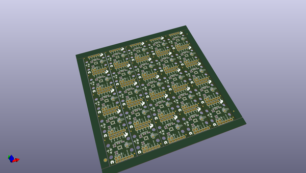
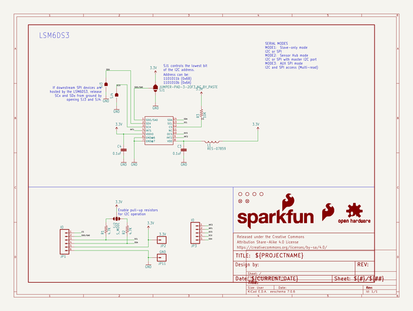
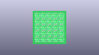
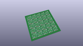
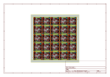
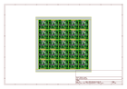
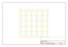
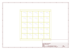
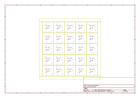

# OOMP Project  
## LSM6DS3_Breakout  by sparkfun  
  
oomp key: oomp_projects_flat_sparkfun_lsm6ds3_breakout  
(snippet of original readme)  
  
SparkFun <PRODUCT NAME>  
========================================  
  
  
  
[*LSM6DS3 Breakout (SEN-13339)*](https://www.sparkfun.com/products/13339)  
  
The LSM6DS3 Breakout board allows easy connection to the LSM6DS3.  
  
The LSM6DS3 is a accelerometer, gyroscope, and temperature sensor with embedded functions targeted at cellphones.  It can do high sample rates and includes an 8kB FIFO buffer for burst reads.  
  
Repository Contents  
-------------------  
  
* **/Documentation** - Data sheets, additional product information  
* **/Hardware** - Eagle design files (.brd, .sch)  
* **/Libraries** - Libraries for use with the LSM6DS3 Breakout  
* **/Production** - Production panel files (.brd)  
  
Documentation  
--------------  
* **[Library](https://github.com/sparkfun/SparkFun_LSM6DS3_Arduino_Library)** - C++ library for the LSM6DS3 Breakout.  
* **[Hookup Guide](https://learn.sparkfun.com/tutorials/lsm6ds3-breakout-hookup-guide)** - Basic hookup guide for the LSM6DS3 Breakout.  
  
Product Versions  
----------------  
* [SEN-13339](https://www.sparkfun.com/products/13339)- LSM6DS3 Breakout board  
  
Version History  
---------------  
* [V_1.0.0](https://github.com/sparkfun/LSM6DS3_Breakout/releases/tag/V_1.0.0) - Initial product release repository  
* [V_0.3.0](https://github.com/sparkfun/LSM6DS3_Breakout/releases/tag/V_0.3.0) - HW version 0.3 release  
  
License Information  
-------------------  
  
This product is _**open source**_!   
  
Please  
  full source readme at [readme_src.md](readme_src.md)  
  
source repo at: [https://github.com/sparkfun/LSM6DS3_Breakout](https://github.com/sparkfun/LSM6DS3_Breakout)  
## Board  
  
  
## Schematic  
  
  
  
[schematic pdf](working_schematic.pdf)  
## Images  
  
  
  
  
  
  
  
  
  
  
  
  
  
  
  
  
