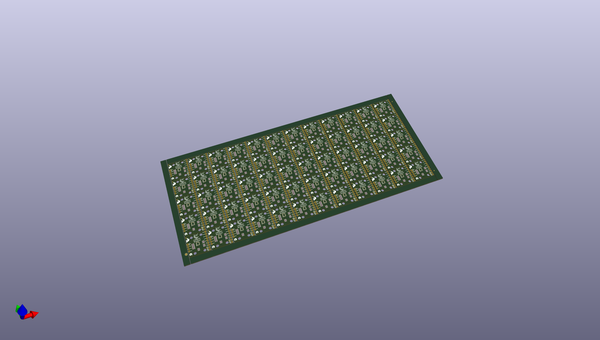
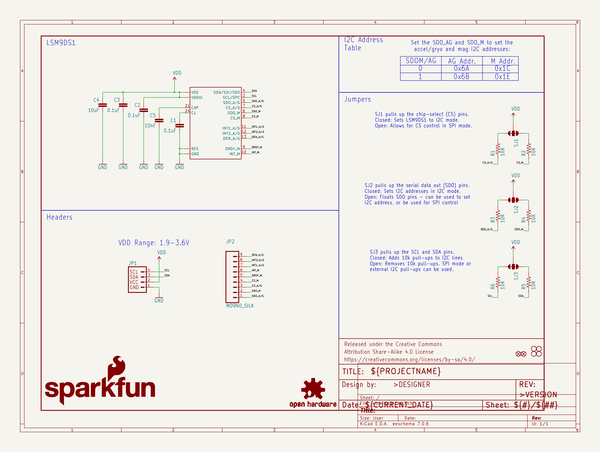
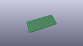
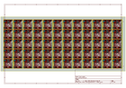
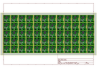
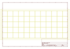
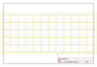
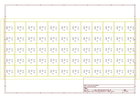

# OOMP Project  
## LSM9DS1_Breakout  by sparkfun  
  
oomp key: oomp_projects_flat_sparkfun_lsm9ds1_breakout  
(snippet of original readme)  
  
SparkFun LSM9DS1 Breakout  
========================================  
  
  
  
[*LSM9DS1 Breakout (SEN-13284)*](https://www.sparkfun.com/products/13284)  
  
The LSM9DS1 is a versatile, motion-sensing system-in-a-chip. It houses a 3-axis accelerometer, 3-axis gyroscope, and 3-axis magnetometer – nine degrees of freedom (9DOF) in a single IC! The LSM9DS1 is equipped with a digital interface, but even that is flexible: it supports both I2C and SPI, so you’ll be hard-pressed to find a microcontroller it doesn’t work with. This IMU-in-a-chip is so cool we put it on the quarter-sized breakout board you are currently viewing!  
  
Repository Contents  
-------------------  
  
* **/Documentation** - Data sheets, additional product information  
* **/Hardware** - Eagle design files (.brd, .sch)  
* **/Libraries** - Libraries for use with the LSM9DS1 Breakout  
* **/Production** - Production panel files (.brd)  
  
Documentation  
--------------  
* **[Library](https://github.com/sparkfun/SparkFun_LSM9DS1_Arduino_Library)** - Arduino library for the LSM9DS1 Breakout.  
* **[Hookup Guide](https://learn.sparkfun.com/tutorials/lsm9ds1-breakout-hookup-guide)** - Basic hookup guide for the LSM9DS1 Breakout.  
* **[SparkFun Fritzing repo](https://github.com/sparkfun/Fritzing_Parts)** - Fritzing diagrams for SparkFun products. This part can be found in the products folder.  
  
Product Versions  
----------------  
* [SEN-13284](https://www.sparkfun.com/prod  
  full source readme at [readme_src.md](readme_src.md)  
  
source repo at: [https://github.com/sparkfun/LSM9DS1_Breakout](https://github.com/sparkfun/LSM9DS1_Breakout)  
## Board  
  
  
## Schematic  
  
  
  
[schematic pdf](working_schematic.pdf)  
## Images  
  
  
  
  
  
  
  
  
  
  
  
  
  
  
  
  
