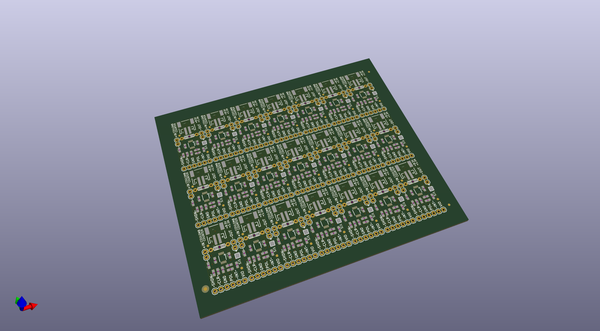
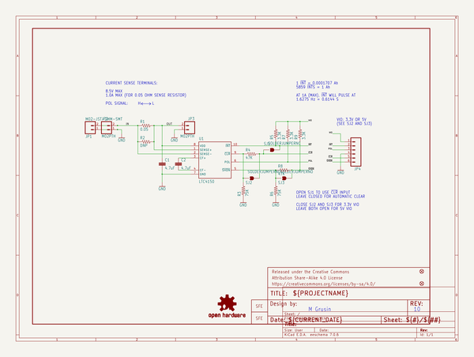
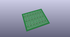
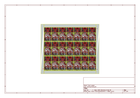
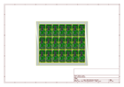
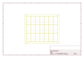
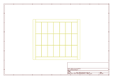
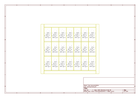

# OOMP Project  
## LTC4150_Coulomb_Counter_BOB  by sparkfun  
  
oomp key: oomp_projects_flat_sparkfun_ltc4150_coulomb_counter_bob  
(snippet of original readme)  
  
SparkFun Coulomb Counter Breakout - LTC4150  
===========================  
  
  
  
_[SparkFun Coulomb Counter Breakout - LTC4150 [ BOB-12052 ]](https://www.sparkfun.com/products/12052)_  
  
  
*Breakout board for the Linear Tech LTC4150 Coulomb Counter (bidirectional current sensor / battery gauge)*  
  
The LTC4150 Coulomb Counter monitors current passing through it (from the IN header or JST connector to the OUT header). Each time 0.1707 mAh passes through the device, the INT pin will pulse low. Or to put it another way, the INT pin will pulse low 5859 times for each Ah that passes through it.  
  
There is also a POL pin that you can check each time INT goes low. POL will be L for current going from IN to OUT, and H for current going from OUT to IN (battery charging).  
  
If you count these pulses and add or subtract from a total depending on the POL signal, you can keep accurate track of the state of a battery connected to the board.  
  
The Coulomb Counter can accommodate power supplies up to 8.5V and up to 1A.  
  
Quickstart (Arduino)  
-------------------  
  
* Configure the jumpers:  
  
    If you're connecting the Coulomb Counter to a 5V system, leave solder jumpers SJ2 and SJ3 (on the bottom of the board) open (the default).  
  
    If you're connecting the Coulomb Counter to a 3.3V system, close both SJ2 and SJ3.  
  
* Hook up the I/O lines:  
  
    Connect VIO t  
  full source readme at [readme_src.md](readme_src.md)  
  
source repo at: [https://github.com/sparkfun/LTC4150_Coulomb_Counter_BOB](https://github.com/sparkfun/LTC4150_Coulomb_Counter_BOB)  
## Board  
  
  
## Schematic  
  
  
  
[schematic pdf](working_schematic.pdf)  
## Images  
  
  
  
  
  
  
  
  
  
  
  
  
  
  
  
  
