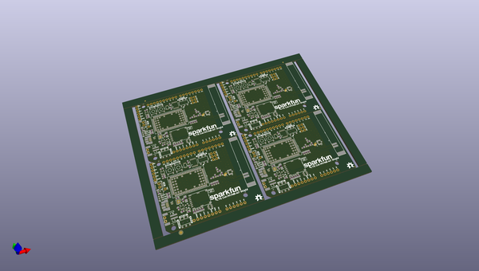

# OOMP Project  
## LTE_Cat_M1_Shield  by sparkfun  
  
oomp key: oomp_projects_flat_sparkfun_lte_cat_m1_shield  
(snippet of original readme)  
  
SparkFun LTE CAT M1/NB-IoT Shield - SARA-R4  
========================================  
  
  
  
[*SparkFun LTE CAT M1/NB-IoT Shield - SARA-R4 (CEL-14997)*](https://www.sparkfun.com/products/14997)  
  
Arduino shield featuring a SARA-R410M-02B module, which supports both Cat M1 and NB-IoT  
  
Repository Contents  
-------------------  
  
* **/Documentation** - Data sheets, additional product information  
* **/Hardware** - Eagle design files (.brd, .sch)  
* **/Production** - Production panel files (.brd)  
  
Documentation  
--------------  
* **[Installing an Arduino Library Guide](https://learn.sparkfun.com/tutorials/installing-an-arduino-library)** - Basic information on how to install an Arduino library.  
* **[Library](https://github.com/sparkfun/SparkFun_LTE_Shield_Arduino_Library)** - Arduino library.  
* **[Hookup Guide](https://learn.sparkfun.com/tutorials/lte-cat-m1nb-iot-shield-hookup-guide)** - Basic hookup guide.  
  
Version History  
---------------  
* v11 - Removed `GND` connection to `AREF` pin  
* [v10](https://github.com/sparkfun/LTE_Cat_M1_Shield/releases/tag/v10) - Initial Release  
  
License Information  
-------------------  
  
This product is _**open source**_!   
  
Various bits of the code have different licenses applied. Anything SparkFun wrote is beerware; if you see me (or any other SparkFun employee) at the   
  full source readme at [readme_src.md](readme_src.md)  
  
source repo at: [https://github.com/sparkfun/LTE_Cat_M1_Shield](https://github.com/sparkfun/LTE_Cat_M1_Shield)  
## Board  
  
  
## Schematic  
  
  
  
[schematic pdf](working_schematic.pdf)  
## Images  
