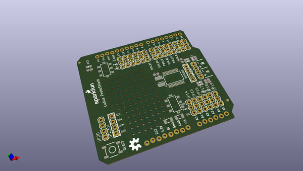
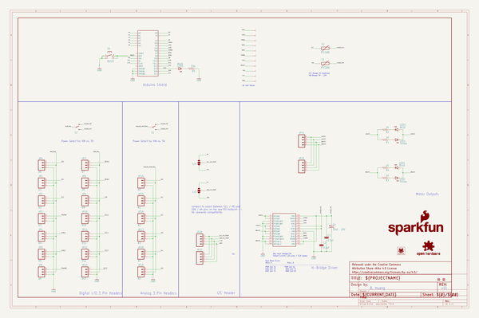
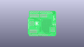
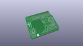
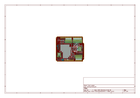
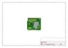
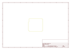
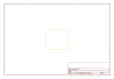
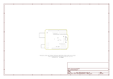

# OOMP Project  
## Ludus_ProtoShield  by sparkfun  
  
(snippet of original readme)  
  
**NOTE:** *This product has been retired from our catalog. If you are looking for more up-to-date info, please check out some of these resources to see how other users are still hacking and improving on this product.*  
* *[SparkFun Forum](https://forum.sparkfun.com/)*  
* *[Comments Here on GitHub](https://github.com/sparkfun/Ludus_ProtoShield/issues)*  
* *[IRC Channel](https://www.sparkfun.com/news/263)*  
  
SparkFun Ludus ProtoShield  
===========================  
  
  
  
[*SparkFun Ludus ProtoShield (DEV-13310)*](https://www.sparkfun.com/products/13310)  
  
This is an Arduino shield that integrates an H-Bridge Driver and breaks out   
all I/O ports to three-pin headers on a GND / PWR / SIG standard. This enables quick  
prototyping and integration of Arduino projects w/o the need of a breadboard.  
  
Ludus is the mascot of the SparkFun Education team. It is a highly intelligent octopus.  
  
  
                   _,--._  
                      ,'      `.  
              |\     / ,-.  ,-. \     /|  
              )o),/ ( ( o )( o ) ) \.(o(  
             /o/// /|  `-'  `-'  |\ \\\o\  
            / / |\ \(   .    ,   )/ /| \ \  
            | | \o`-/    `\/'    \-'o/ | |  
            \ \  `,'              `.'  / /  
         \.  \ `-'  ,'|   /\   |`.  `-' /  ,/  
          \`. `.__,' /   /  \   \ `.__,' ,'/  
           \o\     ,'  ,'    `.  `.     /o/  
            \o`---'  ,'        `.  `---'o/  
             `.____,'  -shimrod  `.  
  full source readme at [readme_src.md](readme_src.md)  
  
source repo at: [https://github.com/sparkfun/Ludus_ProtoShield](https://github.com/sparkfun/Ludus_ProtoShield)  
## Board  
  
  
## Schematic  
  
  
  
[schematic pdf](working_schematic.pdf)  
## Images  
  
  
  
  
  
  
  
  
  
  
  
  
  
  
  
  
