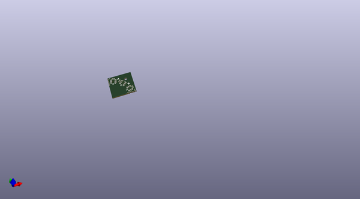
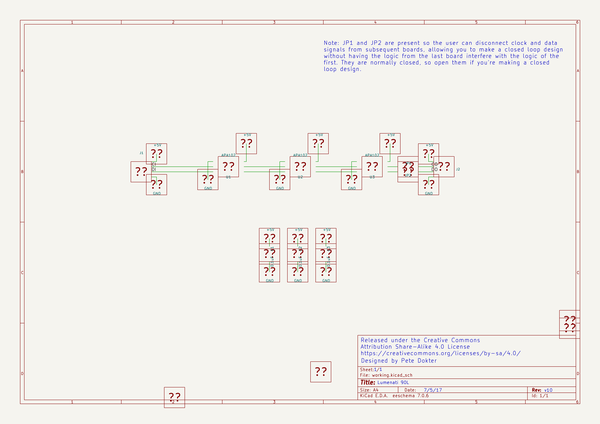

# OOMP Project  
## Lumenati_90L  by sparkfun  
  
(snippet of original readme)  
  
SparkFun Lumenati 90L  
========================================  
  
  
  
[*SparkFun Lumenati 90L (COM-14452)*](https://www.sparkfun.com/products/14452)  
  
The SparkFun Lumenati 90L is a small quarter-circle board equipped with three APA102C LEDs and a single mounting position that has been designed to give your projects an edge in their lighting capacity. The 90L board has been specifically designed to be daisy-chained with other Lumenati boards, thanks to the castellated edge connectors at each end allowing for multiple design options and formations.  
  
Repository Contents  
-------------------  
  
* **/Hardware** - KiCad design files.  
* **/Production** - Production panel files.  
  
Documentation  
--------------  
* **[Example Code](https://github.com/sparkfun/SparkFun_Lumenati_Code)** - Python and Arduino example code for the Lumenati boards.  
* **[FastLED Arduino Library](https://github.com/FastLED/FastLED)** - FastLED Arduino library when using the Lumenati with an Arduino.  
* **[Hookup Guide](https://learn.sparkfun.com/tutorials/lumenati-hookup-guide)** - Basic hookup guide for the SparkFun Lumenati boards.  
  
License Information  
-------------------  
  
This product is _**open source**_!   
  
Please review the LICENSE.md file for license information.   
  
If you have any questions or concerns on licensing, please contact techsupport@sparkfun.com.  
  
Distributed as-is; no warranty is given.  
  
- Your friends at SparkFun.  
  
_<  
  full source readme at [readme_src.md](readme_src.md)  
  
source repo at: [https://github.com/sparkfun/Lumenati_90L](https://github.com/sparkfun/Lumenati_90L)  
## Board  
  
  
## Schematic  
  
  
  
[schematic pdf](working_schematic.pdf)  
## Images  
