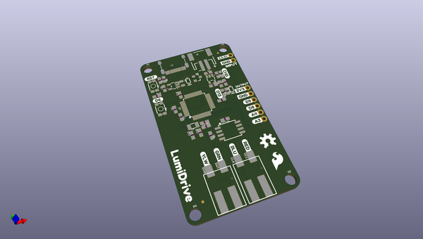
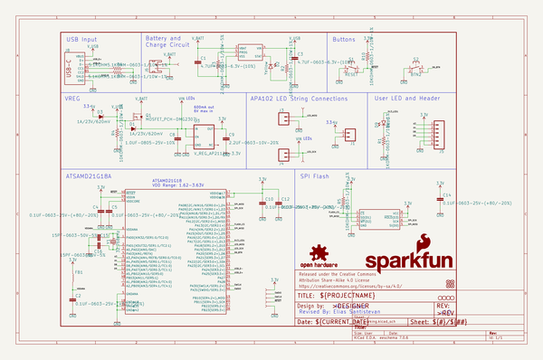
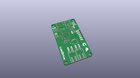
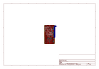
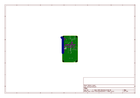
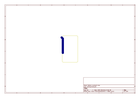
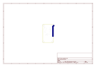
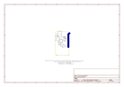

# OOMP Project  
## LumiDrive  by sparkfun  
  
(snippet of original readme)  
  
SparkFun LumiDrive LED Driver   
========================================  
  
  
  
[*SparkFun LumiDrive LED Driver (14779)*](https://www.sparkfun.com/products/14779)  
  
The LumiDrive LED Driver is SparkFun’s foray into all things Python on micro-controllers. With the SparkFun LumiDrive you will be able to control and personalize a whole strand of APA102s directly from the board itself. We’ve broken out a number of analog and digital pins from the on board SAMD21G-AU microcontroller to incorporate your own external buttons, switches, and other interfaces to interact with your addressable LED strip.  
  
It feels like Arduino, but without the need to upload and compile code. Because the LumiDrive opens up like a USB drive on your computer when you plug it in and the code you write lives directly inside the drive it feels very much like an Arduino-device. The fact that you don’t need to upload and compile code makes it a great transitionary LED driver from your traditional Arduino!  
  
The SparkFun LumiDrive has been equipped with a USB-C connector which is capable enough to supply up to 1.5 Amps from a 3.1 USB port, a LiPo connector and charge circuit for portable power, as well as two poke-home connectors to allow you to plug in wires without the need for solder.  
  
Repository Contents  
-------------------  
  
* **/Buzzard Labels** - Silkscreen Libraries for Eagle Files  
* **/Ha  
  full source readme at [readme_src.md](readme_src.md)  
  
source repo at: [https://github.com/sparkfun/LumiDrive](https://github.com/sparkfun/LumiDrive)  
## Board  
  
  
## Schematic  
  
  
  
[schematic pdf](working_schematic.pdf)  
## Images  
  
  
  
  
  
  
  
  
  
  
  
  
  
  
  
  
