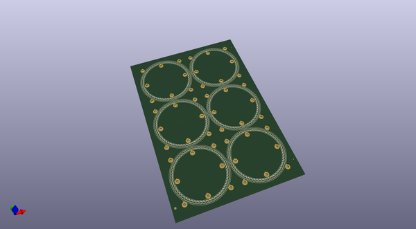
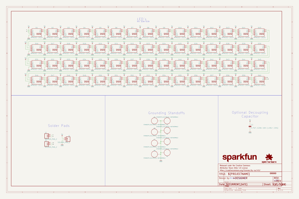
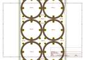
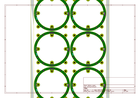
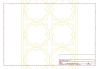
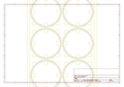
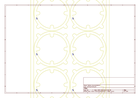
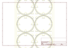

# OOMP Project  
## LuMini_3_Inch  by sparkfun  
  
(snippet of original readme)  
  
SparkFun LuMini 3 Inch Ring  
========================================  
  
  
  
[*LuMini LED Ring - 3 Inch (COM-14965)*](https://www.sparkfun.com/products/14965)  
  
The LuMini rings are a great way to add high density light rings to your project. They use APA102 LEDs to provide bright colors and fast data rates.  
  
Repository Contents  
-------------------  
  
* **/Firmware** - Example code   
* **/Hardware** - Eagle design files (.brd, .sch)  
  
Documentation  
--------------  
* **[Installing an Arduino Library Guide](https://learn.sparkfun.com/tutorials/installing-an-arduino-library)** - Basic information on how to install an Arduino library.  
* **[Library Repository](https://github.com/FastLED/FastLED)** - Arduino library for the APA102.  
* **[Hookup Guide](https://learn.sparkfun.com/tutorials/lumini-ring-hookup-guide)** - Basic hookup guide for the LuMini Rings.  
  
Product Versions  
----------------  
* [COM-14965](https://www.sparkfun.com/products/14965)- 3 Inch LED Ring  
  
License Information  
-------------------  
  
This product is _**open source**_!   
  
Please review the LICENSE.md file for license information.   
  
If you have any questions or concerns on licensing, please contact techsupport@sparkfun.com.  
  
Distributed as-is; no warranty is given.  
  
- Your friends at SparkFun.  
  
  full source readme at [readme_src.md](readme_src.md)  
  
source repo at: [https://github.com/sparkfun/LuMini_3_Inch](https://github.com/sparkfun/LuMini_3_Inch)  
## Board  
  
  
## Schematic  
  
  
  
[schematic pdf](working_schematic.pdf)  
## Images  
  
  
  
  
  
  
  
  
  
  
  
  
  
  
  
  
