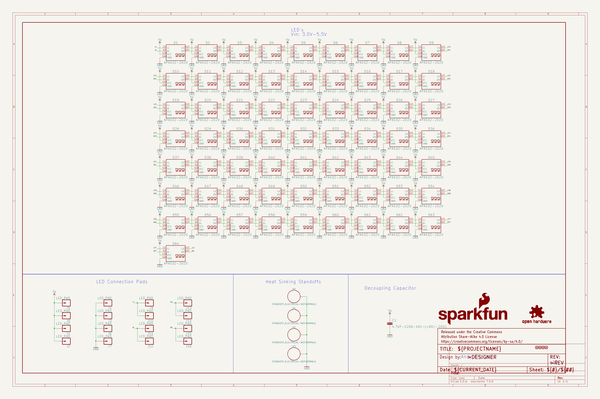
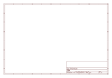
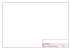

# OOMP Project  
## Lumini_8x8  by sparkfun  
  
oomp key: oomp_projects_flat_sparkfun_lumini_8x8  
(snippet of original readme)  
  
SparkFun LuMini 8x8 Matrix  
========================================  
  
  
  
[*SparkFun LuMini LED matrix (COM-15047)*](https://www.sparkfun.com/products/15047)  
  
The LuMini 8x8 Matrix is a great way to add a square of light to just about anything, or even make a screen of a custom shape. The LuMini product line uses the same LED used on our Lumenati boards, the APA102, just in a smaller, 2.0x2.0 mm package. This allows for incredibly tight pixel densities, and thus, a screen with less pixelation.   
  
Repository Contents  
-------------------  
  
* **/Firmware** - Example code   
* **/Hardware** - Eagle design files (.brd, .sch)  
* **/Production** - Production panel files (.brd)  
  
Documentation  
--------------  
* **[Hookup Guide](https://learn.sparkfun.com/tutorials/lumini-8x8-matrix-hookup-guide)** - Basic hookup guide for the LuMini 8x8 LED Matrix.  
  
Product Versions  
----------------  
* [COM-15047](https://www.sparkfun.com/products/15047)- 8x8 matrix of APA102 LED's packed into a single square inch.  
  
License Information  
-------------------  
  
This product is _**open source**_!   
  
Please review the LICENSE.md file for license information.   
  
If you have any questions or concerns on licensing, please contact techsupport@sparkfun.com.  
  
Distributed as-is; no warranty is given.  
  
- Your friends at SparkFun.  
  
  full source readme at [readme_src.md](readme_src.md)  
  
source repo at: [https://github.com/sparkfun/Lumini_8x8](https://github.com/sparkfun/Lumini_8x8)  
## Board  
  
  
## Schematic  
  
  
  
[schematic pdf](working_schematic.pdf)  
## Images  
  
  
  
  
  
  
  
  
  
  
  
  
  
  
  
  
