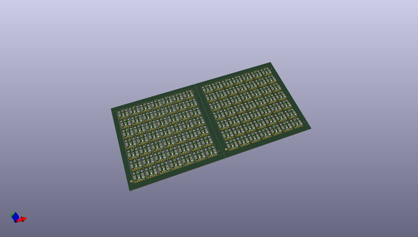
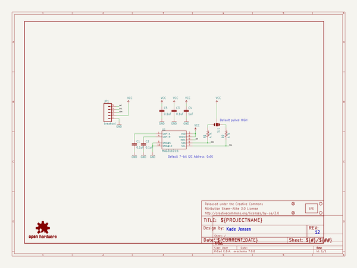
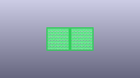
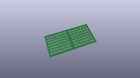
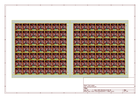
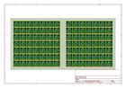
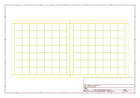
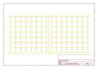
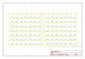
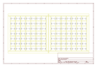

# OOMP Project  
## MAG3110_Breakout_Board  by sparkfun  
  
(snippet of original readme)  
  
**NOTE:** *This product has been retired from our catalog. If you are looking for more up-to-date info, please check out some of these resources to see how other users are still hacking and improving on this product.*  
* *[SparkFun Forum](https://forum.sparkfun.com/)*  
* *[Comments Here on GitHub](https://github.com/sparkfun/MAG3110_Breakout_Board/issues)*  
  
Triple Axis Magnetometer Breakout - MAG3110  
============================================  
  
__  
  
[*Triple Axis Magnetometer Breakout - MAG3110 (SEN-12670)*](https://www.sparkfun.com/products/12670)  
  
Breakout board for MAG3110 digital magnetometer [The datasheet can be found here.](https://dlnmh9ip6v2uc.cloudfront.net/datasheets/Sensors/Magneto/MAG3110.pdf)  
  
This board was created in Eagle v6.5.0.   
  
Repository Contents  
-------------------  
  
* **/Hardware** - All Eagle design files (.brd and .sch)  
* **/Libraries** - Arduino libraries  
* **/Production** - Production panel files  
  
Documentation  
--------------  
  
* **[Library](https://github.com/sparkfun/SparkFun_MAG3110_Breakout_Board_Arduino_Library)** - Arduino library   
* **[Hookup Guide](https://learn.sparkfun.com/tutorials/mag3110-magnetometer-hookup-guide-)** - Basic hookup guide   
* **[SparkFun Fritzing repo](https://github.com/sparkfun/Fritzing_Parts)** - Fritzing diagrams for SparkFun products.  
* **[SparkFun 3D Model repo](https://github.com/sparkfun/3D_Models)** - 3  
  full source readme at [readme_src.md](readme_src.md)  
  
source repo at: [https://github.com/sparkfun/MAG3110_Breakout_Board](https://github.com/sparkfun/MAG3110_Breakout_Board)  
## Board  
  
  
## Schematic  
  
  
  
[schematic pdf](working_schematic.pdf)  
## Images  
  
  
  
  
  
  
  
  
  
  
  
  
  
  
  
  
