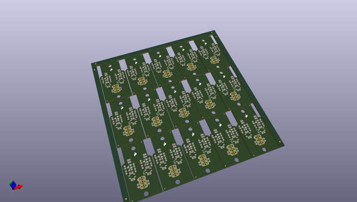
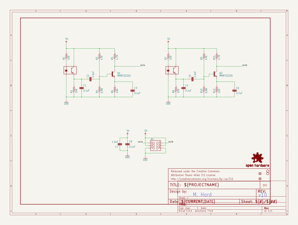
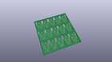
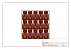
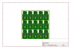
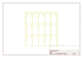
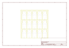
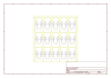

# OOMP Project  
## Magician_Encoder  by sparkfun  
  
(snippet of original readme)  
  
Magician Chassis Encoder  
==================  
  
Reflectance based wheel encoder for use with the Magician chassis; supported by the RedBot Library.  
  
[    
*Magician Chassis Encoder*](https://www.sparkfun.com/products/12617)  
  
Design files and firmware files for the [Magician Chassis Encoder](https://www.sparkfun.com/products/12617).  
  
Repository Contents  
-------------------  
  
* **/hardware** - Eagle PCB layout files  
* **/Production Files** - Files to support SparkFun production  
  
  
License Information  
-------------------  
  
All contents of this repository are released under [Creative Commons Share-alike 3.0](http://creativecommons.org/licenses/by-sa/3.0/).  
  
Authors: Mike Hord @ SparkFun Electonics  
  
  full source readme at [readme_src.md](readme_src.md)  
  
source repo at: [https://github.com/sparkfun/Magician_Encoder](https://github.com/sparkfun/Magician_Encoder)  
## Board  
  
  
## Schematic  
  
  
  
[schematic pdf](working_schematic.pdf)  
## Images  
  
  
  
  
  
  
  
  
  
  
  
  
  
  
  
  
